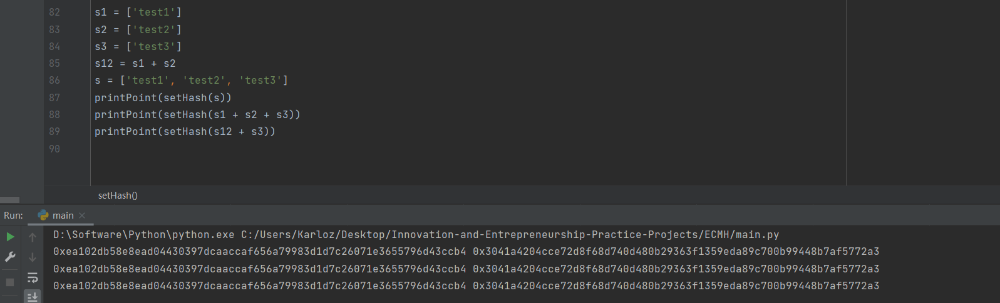

### Project: Implement the above ECMH scheme

##### 代码说明

本项目实现了将集合hash到椭圆曲线点的算法，并检测了其同态性质。

采用的计算方法为：

对于单独的一条信息（字符串形式），将其编码成字节流并使用md5进行hash，映射到$F_P$上的整数$x$。将得到的$x$作为椭圆曲线点的横坐标，代入方程计算$temp=y^2=x^3+ax+b$。注意，在模p的意义下，所得的temp并不一定是二次剩余，横坐标为x的点不在曲线上。如果出现这种情况，则将$x$继续hash或者简单的令$x=x+1$，本项目选择了后者。其中判断二次剩余的方法为欧拉准则，计算其Legendre符号。

```python
def legendre(a, p):
    return pow(a, (p - 1) // 2, p)
```

当得到了合理的$y^2$后，需要计算其平方根，得到点的纵坐标。这里采用的是Cipolla算法。

```python
def Cipolla(n, p):
    while True:
        a = random.randint(0, p - 1)
        if legendre(a * a - n, p) == p - 1:
            break
    u = C(a, 1)
    u = Cpow(a, n, p, u, (p + 1) // 2)
    # 平方根存在两个解，且一定为y和p-y的形式(y<p/2)。为保证hash值唯一性，取较大的一个。
    if u.a < p // 2:
        u.a = p - u.a
    return u.a % p
```

其原理为：

首先找到一个$a$使得$a^2-n$是二次非剩余，并令$i^2=a^2-n\ (mod\ p)$。这需要定义一个新的代数系统$<\mathbb{Z}_p(i),+,×>$，其中$i^2=a^2-n\ (mod\ p)$。可以证明这是一个环，然后用类似于复数的计算方法即可。

计算$(a+i)^{\frac{p+1}{2}}$的结果即为n的一个平方根。

由于$(a+i)^{p+1}=(a+i)^p*(a+i)$，二项展开前一项，只有0次和p次项不含p，因此原式等价于$(a^p+i^p)*(a+i)$。

根据费马小定理，$a^p=a\ (mod\ p)$，而$i^p=i^{p-1}*i=(a^2-n)^{\frac{p-1}{2}}*i$。$a^2-n$是二次非剩余，等式最右边前一项为-1，因此最终结果为$-i$。

于是原式$=(a-i)(a+i)=a^2-i^2=n$。也即$(a+i)^{p+1}=n$，自然$(a+i)^{\frac{p+1}{2}}$就是原方程的一个解。

```python
def Cipolla(n, p):
    while True:
        a = random.randint(0, p - 1)
        if legendre(a * a - n, p) == p - 1:
            break
    u = C(a, 1)
    u = Cpow(a, n, p, u, (p + 1) // 2)
    # 平方根存在两个解，且一定为y和p-y的形式(y<p/2)。为保证hash值唯一性，取较大的一个。
    if u.a < p // 2:
        u.a = p - u.a
    return u.a % p
```

这样就实现了将一条消息hash到椭圆曲线上的点。

```python
def Hash(msg):
    # 将单个点使用md5映射到椭圆曲线点的横坐标
    x = int(hashlib.md5(msg.encode()).hexdigest(), 16) % p
    temp = x ** 3 + a * x + b
    while legendre(temp, p) != 1:
        x += 1
        temp = x ** 3 + a * x + b
    y = Cipolla(temp, p)
    return Point(E, x, y)
```

------

对于集合，只需要将其中的每一条记录单独做点hash再累加到一起即可。

```python
def setHash(s):
    P = Hash(s[0])
    for msg in s[1:]:
        P += Hash(msg)
    return P
```

##### 运行结果

见下图，验证了多个集合的不同组合形式，得到了相同的结果，证明了实现的正确性。



##### 运行指导

直接运行main.py。

