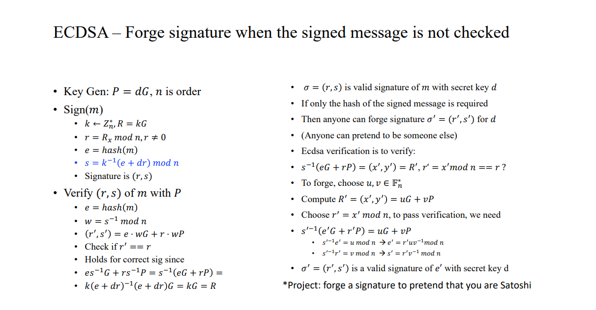
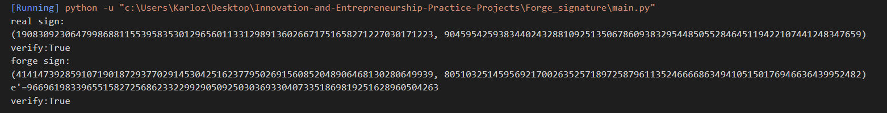

### Project: forge a signature to pretend that you are Satoshi

##### 代码说明

该项目实现了应用在比特币中的ECDSA签名在不检查消息明文m的情况下合法签名的伪造。

首先实现ECDSA签名及其验证过程。



由于项目场景的需求，验签算法不检查消息明文m而是直接使用其hash值e。具体流程见上图：

我们已经在Curve.py中实现了椭圆曲线类的计算，并且通过对运算符的定义，使得可以直接使用+,*这样的运算符来操作椭圆曲线点和数字之间的运算，极大的方便了代码的编写。

```python
def sign(d, m):
    k = random.randint(1, n - 1)
    R = k * G
    r = R.x % n
    e = int(Hash(m), 16)
    s = (inv_mod(k, n) * (e + d * r)) % n
    return r, s


# 不检查消息m
def verify(r, s, e, P):
    w = inv_mod(s, n)
    Pt = e * w * G + r * w * P
    if r != Pt.x:
        return False
    return True
```

按照如下原理伪造签名：

假设已经得到了真实有效的合法签名$(r,s)$。

验证签名的原理是计算$s^{-1}(eG+rP)=(x',y')=R'$，并验证$x'\ mod\ n$是否等于$r$。

针对此过程，可以随机选择$u,v \in \mathbb{F}^*_n$，计算$R'=(x',y')=uG+vP$。

根据验证等式，应当有：
$$
{s'}^{-1}(e'G+r'P)=uG+vP
$$
也即
$$
{s'}^{-1}e'=u \rightarrow e'=ruv^{-1}\ (mod\ n)\\
{s'}^{-1}r'=u \rightarrow s'=rv^{-1}\ (mod\ n)\\
$$
计算得到$(r',s',e')$。这样就伪造了可以通过验证的签名值。

```python
def forge(r, s):
    u = random.randint(1, n - 1)
    v = random.randint(1, n - 1)
    R_ = u * G + v * P
    r_ = R_.x % n
    e_ = (r_ * u * inv_mod(v, n)) % n
    s_ = (r_ * inv_mod(v, n)) % n
    return r_, s_, e_
```

------

##### 运行结果

分别生成真实的和伪造的签名并进行验证，最终均通过测试。

```python
r, s = sign(d, msg)
e = int(Hash(msg), 16)
print('real sign:\n', (r, s), sep='')
print('verify:', verify(r, s, e, P), sep='')

r_, s_, e_ = forge(r, s)
print('forge sign:\n', (r_, s_), sep='')
print('e\'=', e_, sep='')
print('verify:', verify(r_, s_, e_, P), sep='')
```



------

##### 运行指导

直接运行main.py

**需要Curve.py文件**