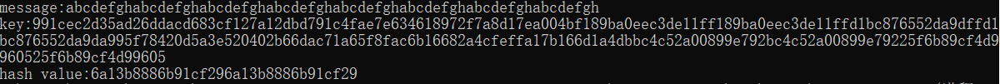

# Meow hash

**Project: Find a 64-byte message under some k fulfilling that their hash value is symmetrical**

------

#### 代码说明

 目的是找到一个64字节的明文消息以及对应的密钥使得计算得到的hash值是对称的。这里的对称是指hash的前面一半和后面一半相同。

由于前面已经很好的实现了meow_hash的逆向，也即给出特定的hash值以及明文，可以得到一个合法的密钥，使得给定明文在该密钥作用下hash值为给定的值。因此，只需要规定一个对称的目标hash值，在给出任意64字节消息，即可得到密钥。这样就找到了满足要求的明文和密钥。

可逆性的实现在前面的项目中已经完整详细地介绍过，不再赘述。这里做的改动仅仅是明文及目标hash值。

```c
char hash[] = { 0x6a,0x13,0xb8,0x88,0x6b,0x91,0xcf,0x29,0x6a,0x13,0xb8,0x88,0x6b,0x91,0xcf,0x29 }; //symmetrical
char msg[] = "abcdefghabcdefghabcdefghabcdefghabcdefghabcdefghabcdefghabcdefgh"; // 64bytes
```

#### 运行结果

计算出一个密钥，再用此密钥计算一次hash值，查看结果是否与目标相同。



可见结果完全正确。

#### 运行指导

在本项目文件夹中，打开vs项目meow_hash.sln，运行源文件即可。
