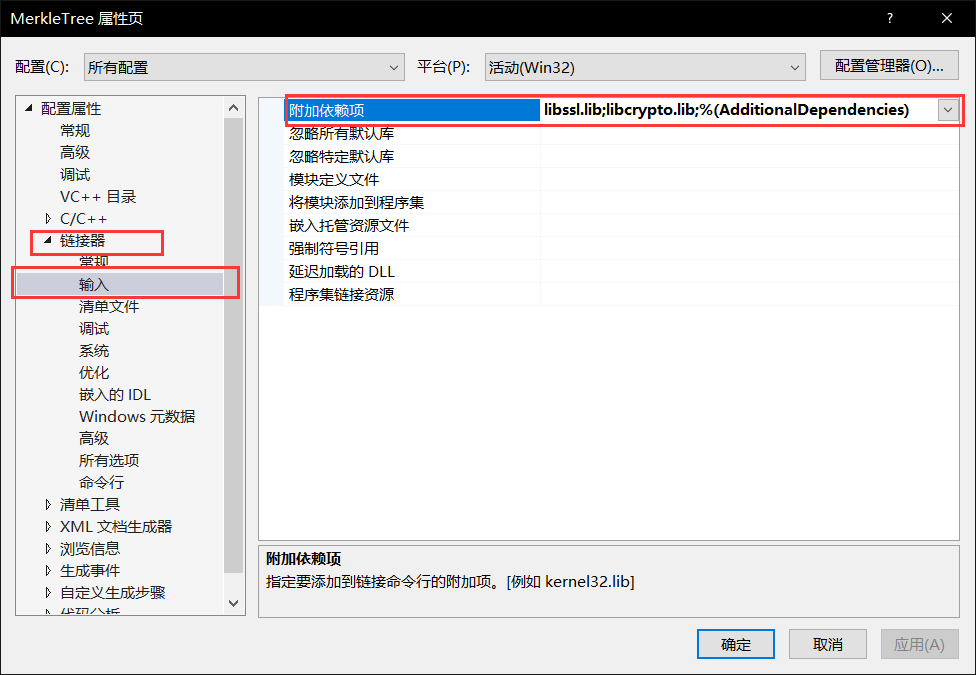

# Merkle Tree

**Project: Impl Merkle Tree following RFC6962**

该项目完整地实现了Merkle树的结构，成功构造了一颗$10^5$个节点的Merkle树，并使用dfs验证了树的结构保持了完全二叉树的形态。

最后，实现了存在性证明并验证其功能。

### 代码说明

#### 建立树结构

设置${10}^5$个节点。为方便检查，令第i个点中保存的数据为数字i的字符串形式。比如，第0号节点中的原始数据是字符串“0”。

节点结构如下： 

其属性包括左右子树，深度，保存的hash值。

```c++
struct MerkleTreeNode
{
	MerkleTreeNode* left,*right;
	MerkleTreeNode* parent;
	uint hash_num;
	uchar hash_str[32];
	int depth;
	MerkleTreeNode() { this->left = this->right = this->parent = nullptr; hash_num = 0; memset(hash_str, 0, 32); depth = 0; }
	MerkleTreeNode(int depth) { this->left = this->right = this->parent = nullptr; hash_num = 0; memset(hash_str, 0, 32); this->depth = depth; };
}*root = nullptr, *leaves[MAXN];
```

最关键的地方在于建树的过程。

最开始考虑的是递归建树方案。将整体的建立过程分解为：假设目前已经有了一颗结构正确的树，每次向已有的完全二叉树中添加新的点，并选择合适位置，使其仍保持完全二叉树形式，最后返回新的树结构。

递归的方案是可行的。然而这样的做法实际上每次添加一个点就要调用一次递归过程，当节点数量较多时会发生栈溢出。显然这不能承载$10^5$个节点的构造，因此必须选择循环的方式。

事实发现，递归其实是完全没有必要的。因为我们进行一轮迭代之后，需要的信息只是当前的树根节点就可以确认整棵树的状态，而没有其他的依赖。从树根向下寻找可插入的位置是$O(\log n)$的复杂度，速度很快。因此直接将递归过程修改为循环即可。

具体方法为：每添加一个点后返回当前的根节点指针，代表新的树结构。下次添加时，从根节点开始考虑。

下面介绍建树如何维护完全二叉树结构。（可以参考build函数代码）

我们以指针**mt**标志树的根节点，最开始**mt**为空。

当添加一个点时，有三种情况：

1. **mt**不存在，此时只需要创建新的根节点，将新点添加到根的左子树。
2. **mt**已存在，即已有一棵树。此时这棵树不是完整的完全二叉树，也即叶子节点的数量不是2的幂次个，有合适的位置可以按照顺序将新点插入到树中。
3. 已有一颗完全二叉树，没有可用的位置插入。此时需要创建新的根节点，将已有的整个树看作根的左子树，并建立与其深度相同的右子树（一路向下创建左子树），并将新叶子节点插入到最后一层。

每次插入完成后，自底向上更新hash值，直到根节点。

#### 存在性证明

为了方便查找目的位置，提前保存了所有叶子结点的指针。

输入一个数据和位置，希望证明该数据确实在树中，且确实在给定的位置上。

只需要找到目的位置，计算给定数据的hash值作为该点可能的真实hash值，迭代向上每次与0x01||兄弟节点hash值级联，计算新的hash值，一直到根。最后比较根的hash值是否与计算结果相同。如果相同，说明数据正确，输出1，反之为0。

#### 运行结果

```c++
int main()
{
	init();
	FOR(i, 0, MAXN)root = build(root, Data + i, MAXN - i);

	printf("%d\n", inProve("0", 0));
	printf("%d\n", inProve("0", 1));
	return 0;
}
```

执行代码，首先构造Merkle树。然后进行存在性证明测试。

前面说到，为了方便测试，我们设定$i$号节点保存了数字$i$的字符串形式。因此，字符串“0”应当存在于0号节点中，而不存在于1号。

也就是说，如果实现正确，上面进行的两次证明结果应分别是存在和不存在。

结果见下图，分别证明数据0是否在0号和1号节点中，可见证明有效。


#### 运行指导

本项目使用了OpenSSL的hash函数库，首先需要导入OpenSSL库的相关依赖。

考虑到这个问题，已经在仓库中上传了OpenSSL相关文件，位置如下图：


具体做法为：

首先进入vs工程项目，打开调试属性设置.


选择V/C++目录，添加包含目录和库目录。


选择包含目录，打开编辑。


点击红框按钮添加新行，然后点击下面的...按钮选择目录


选择本仓库下，openssl库中的include文件夹。确定即可。


库目录的添加操作相同，但要选择lib文件夹。


完成后，选择链接器-输入-附加依赖项。



打开编辑，输入如下内容（要换行）。


确定即可。

这样就完成了openssl的配置。

然后运行代码即可。

