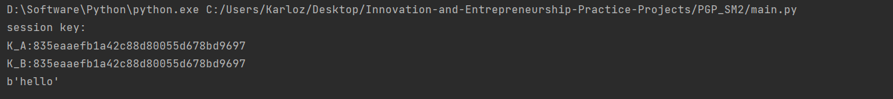

### **Project: Implement a PGP scheme with SM2**

##### 代码说明

本项目核心在于实现PGP方案的各个流程，而具体的密码算法在其他项目中均以涉及过，故这里不再单独实现，而是使用gmssl库函数实现方案。整体上分为SM2密钥交换，SM2加解密安全传输会话密钥，利用会话密钥使用对称密码传输会话消息三部分组成。

重点介绍SM2密钥交换。

假设A为发起方，A，B协商得到$klen$比特的密钥。

首先计算摘要$Z_A=Hash(ENTL_A||ID_A||a||b||x_G||y_G||x_A||y_A)$和$Z_B=Hash(ENTL_B||ID_B||a||b||x_G||y_G||x_B||y_B)$。

记$w=\lceil\frac{\lceil\log_2n\rceil}{2}\rceil-1$

用户A执行：

> 随机生成$r_A\in [0,n-1]$。
>
> 计算椭圆曲线点$R_A=r_A*G=(x_1,y_1)$
>
> 发送$R_A$给用户B

------

用户B执行：

> 随机得到$r_B\in [0,n-1]$
>
> 计算椭圆曲线点$R_B=r_B*G=(x_2,y_2)$
>
> 计算$x'_2 = 2^w+(x_2\ \mbox{\&} \ (2^w−1))$
>
> 计算$t_B = d_B + x'_2*r_B \ (mod\ n)$
>
> 验证$R_A$是否满足椭圆曲线方程，不满足则报错退出
>
> 计算$x'_1 = 2^w+(x_1\ \& \ (2^w−1))$
>
> 计算椭圆曲线点$V=[h \cdot t_B](P_A+[x_1']R_A) = (x_V,y_V)$
>
> 计算$K_B = KDF(x_V\|y_V\|Z_A\|Z_B,len)$
>
> 计算摘要$S_B = H(0x02\|y_V\|H(x_V\|Z_A\|Z_B\|x_1\|y_1\|x_2\|y_2))$
>
> 发送$R_B,S_B$​给用户A

------

用户A执行：

> 计算$x_1' = 2^w + (x_1 \& (2^w-1))$
>
> 计算$t_A = d_A+x_1' \cdot r_A \mod n$
>
> 验证$R_B$是否满足椭圆曲线方程，不满足则报错退出
>
> 计算$x_2' = 2^w + (x_2 \& (2^w-1))$
>
> 计算椭圆曲线点$U=[h \cdot t_A](P_B+[x_2']R_B) = (x_U,y_U)$
>
> 计算摘要$S_1 = H(0x02\|y_U\|H(x_U\|Z_A\|Z_B\|x_1\|y_1\|x_2\|y_2))$
>
> 检验是否满足 $S_1=S_B$，若不满足则报错退出
>
> 计算$K_A = KDF(x_U\|y_U\|Z_A\|Z_B,len)$
>
> 计算摘要$S_A = H(0x03\|y_U\|H(x_U\|Z_A\|Z_B\|x_1\|y_1\|x_2\|y_2))$
>
> 发送$S_A$给用户B

------

用户B执行：

> 计算摘要$S_2 = H(0x03\|y_V\|H(x_V\|Z_A\|Z_B\|x_1\|y_1\|x_2\|y_2))$
>
> 检验是否满足$S_2=S_A$，若不满足则报错退出

流程结束，用户A和B获得了相同的密钥$K_A=K_B$。

------

下面是该过程的完整代码实现。

```python
Z_A = Hash(
    ENTL_A + ID_A + hex2str(a) + hex2str(b) + hex2str(g_X) + hex2str(g_Y) + hex2str(P_A.x) + hex2str(P_A.y))
Z_B = Hash(
    ENTL_B + ID_B + hex2str(a) + hex2str(b) + hex2str(g_X) + hex2str(g_Y) + hex2str(P_B.x) + hex2str(P_B.y))

w = ceil(log2(n) / 2) - 1

# A
r_A = random.randint(1, n - 1)
R_A = r_A * G
x_1 = 2 ** w + (R_A.x & (2 ** w - 1))

# B
r_B = random.randint(1, n - 1)
R_B = r_B * G
x_2 = 2 ** w + (R_B.x & (2 ** w - 1))
t_B = (d_B + x_2 * r_B) % n
if not E.contains_point(R_A.x, R_A.y):
    print("Wrong1")
x_1 = 2 ** w + (R_A.x & (2 ** w - 1))
V = t_B * (P_A + x_1 * R_A)
K_B = KDF(hex2str(V.x) + hex2str(V.y) + Z_A + Z_B, 128)
S_B = Hash('\x02' + hex2str(V.y) + Hash(
    hex2str(V.x) + Z_A + Z_B + hex2str(R_A.x) + hex2str(R_A.y) + hex2str(R_B.x) + hex2str(R_B.y)))

# A
t_A = (d_A + x_1 * r_A) % n
if not E.contains_point(R_B.x, R_B.y):
    print("Wrong2")
x_2 = 2 ** w + (R_B.x & (2 ** w - 1))
U = t_A * (P_B + x_2 * R_B)
S_1 = Hash('\x02' + hex2str(U.y) + Hash(
    hex2str(U.x) + Z_A + Z_B + hex2str(R_A.x) + hex2str(R_A.y) + hex2str(R_B.x) + hex2str(R_B.y)))
if S_1 != S_B:
    print('Wrong3')
K_A = KDF(hex2str(U.x) + hex2str(U.y) + Z_A + Z_B, 128)
S_A = Hash('\x03' + hex2str(U.y) + Hash(
    hex2str(U.x) + Z_A + Z_B + hex2str(R_A.x) + hex2str(R_A.y) + hex2str(R_B.x) + hex2str(R_B.y)))

# B
S_2 = Hash('\x03' + hex2str(V.y) + Hash(
    hex2str(V.x) + Z_A + Z_B + hex2str(R_A.x) + hex2str(R_A.y) + hex2str(R_B.x) + hex2str(R_B.y)))
if S_2 != S_A:
    print("Wrong4")
```

------

使用密钥交换产生了会话密钥后，加入一层公钥加密，由A使用B的公钥将会话密钥加密并发送至对方，进一步保证安全性。

完成了会话密钥的协商，本次会话的消息传递转而使用对称加密。本项目使用的是SM4，密钥为商定的128bit会话密钥。

最终测试商定密钥的一致性以及会话消息的加解密的正确性来检测实现的效果。

------

##### 运行结果

输出密钥协商后A，B双方各自持有的会话密钥验证一致性。

输出使用会话密钥加密后再解密所得的消息验证正确性。



结果完全正确。

------

##### 运行指导

直接运行main.py

**==需要Curve.py文件==**