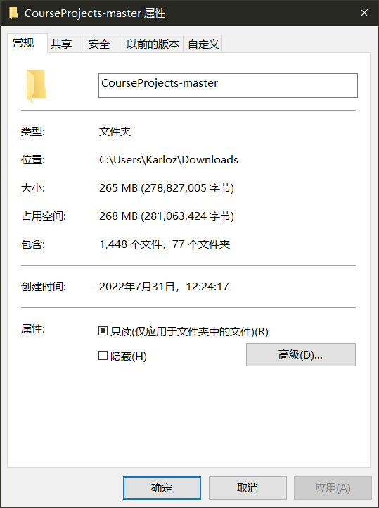

# 网络空间安全创新创业实践项目实验

所有项目均为本人独立完成。

为了方便管理，该仓库包含了整个实践课程所有的项目。其中，每个子文件夹为一个完整项目。因此只需要下载该仓库的内容即可获取所有项目文件。通常，进入项目的文件夹就可以执行代码，如有特殊要求，均会在项目文档中说明。

该文档介绍了课程项目整体的信息，包括以下部分：

- 完成的项目名称及其简要说明
- 存在问题的项目以及其中的问题
- 更新日志

具体到单个项目的代码说明等信息见各个项目文件夹中的README文档，这里不会涉及到。

**注：**

**1. 由于每天都可能会对已经上传的项目进行优化或修改完善，最后一次提交的时间通常比较集中，真实的完成时间可以参考项目目录中最早的提交日期或者本文档下面的更新日志部分。**

**2.完整的仓库压缩包大小约为88.8MB，解压后为508MB。若下载的文件大小小于该值，则说明丢失了部分文件，可能会导致代码不能正确运行。使用网页直接下载压缩包很容易出现这个问题，建议使用git clone。**

### 所做项目及其简单说明

1. **Project: implement the naïve birthday attack of reduced SM3**

对SM3哈希算法尝试进行生日攻击寻找碰撞。考虑到内存限制，截取hash值的前32位作为结果。前32位相同的视为找到一组碰撞。使用c代码实现并成功找到一组碰撞。

2. **Project: implement the Rho method of reduced SM3**

使用低存储的$\rho$方法寻找碰撞，在可接受的时间内暂时只能找到16位的碰撞。

3. **Project: implement length extension attack for SM3, SHA256, etc.**

对SM3进行长度扩展攻击。

4. **Project: do your best to optimize SM3 implementation (software)**

使用宏定义、SIMD、算法优化等方法优化SM3，效果显著。

5. **Project: Impl Merkle Tree following RFC6962**

实现了Merkle Tree以及其存在性证明。

6. **Project: report on the application of this deduce technique in Ethereum with ECDSA**

对以太坊中使用的ECDSA签名以及其公钥推导总结出一份报告。

7. **Project: impl sm2 with RFC6979**

根据RFC6979实现了对k的生成，在此基础上实现了SM2签名及其验证算法。

8. **Project: Implement a PGP scheme with SM2**

实现了基础的PGP模块，包括SM2密钥交换生成会话密钥、SM2加密会话密钥、根据会话密钥使用SM4对称加密会话数据三个部分。

9. **Project: implement sm2 2P sign with real network communication**

使用socket网络编程，在真实的网络环境下实现了SM2两方签名，并检查了验证签名的正确性。

10. **Project: implement sm2 2P decrypt with real network communication**

同样使用socket，实现了数据的两方加密和解密，并验证了加解密正确性。

11. **Project: forge a signature to pretend that you are Satoshi**

在不验证消息明文m而只使用消息哈希e的情况下，根据已有的正确签名伪造了新的签名，并正确通过验证。

12. **Project: Find a key with hash value “sdu_cst_20220610” under a message composed of your name followed by your student ID. For example, “San Zhan 202000460001**“

针对meow_hash库，利用逆向工程原理，完整地将hash计算过程完全逆回初始状态，从而实现了根据消息明文和目标hash值计算出一组合适的密钥。并且使用所得密钥尝试进行hash，所得结果和目标值完全一致。

13. **Project: verify the above pitfalls with proof-of-concept code**

编写测试代码，验证各种ECC签名算法的漏洞。

14. **Project: Implement the above ECMH scheme**

实现了将集合hash到椭圆曲线点的ECMH方案，并验证了其同态性质。

15. **Project: PoC impl of the scheme, or do implement analysis by Google**

在真实网络交互的场景下实现了基于argon2的用户口令检查方案。

16. **Project: Find a 64-byte message under some k fulfilling that their hash value is symmetrical**

找到一组64字节消息和密钥使得输出的hash值是对称的。

17. **Project: send a tx on Bitcoin testnet, and parse the tx data down to every bit, better write script yourself**

成功实现了在比特币测试网上申请比特币并发布一笔交易。同时编写脚本对于该交易原始数据进行了解析。

18. **Project: research report on MPT**

关于Merkle Patricia Tree进行了详细的研究并产出一份研究报告。

19. SM4优化

对于SM4算法进行了显著优化。

20. SM2环签名方案

基于SM2，使用openssl库实现了一个可在真实网络环境下运行的安全的，无条件匿名的环签名方案。

##### 存在问题的项目

11. **Project: forge a signature to pretend that you are Satoshi**

由于并未搜索到明确属于中本聪本人的公钥，这里选择随机生成了一对公私钥，但伪造的原理依然适用。

###### 更新日志

22-05-15：提交项目

**Project: implement length extension attack for SM3, SHA256, etc.**。

22-07-16：提交项目

**Project: implement the Rho method of reduced SM3**

**Project: implement the naïve birthday attack of reduced SM3**。

22-07-17：提交项目

**Project: Impl Merkle Tree following RFC6962**

22-07-18：提交项目

**Project: Find a key with hash value “sdu_cst_20220610” under a message composed of your name followed by your student ID. For example, “San Zhan 202000460001**”

22-07-19：提交项目

**Project: impl sm2 with RFC6979**

22-07-20：提交项目

**Project: do your best to optimize SM3 implementation (software)**

22-07-21：提交项目

**Project: Implement a PGP scheme with SM2**

22-07-22：提交项目

**Project: implement sm2 2P sign with real network communication**

**Project: implement sm2 2P decrypt with real network communication**

22-07-23：提交项目

**Project: forge a signature to pretend that you are Satoshi**

22-07-25：

提交项目

**Project: verify the above pitfalls with proof-of-concept code**

**Project: Implement the above ECMH scheme**

**Project: report on the application of this deduce technique in Ethereum with ECDSA**

更新了部分项目的README。

更新了椭圆曲线相关库函数。

根据代码运行环境需要，上传了OpenSSL库。

22-07-26：

更新了所有项目中涉及到的的hash函数，考虑到安全性，将md5等不再安全的算法更换成SHA256。

22-07-27：提交项目

**Project: PoC impl of the scheme, or do implement analysis by Google**

**Project: Find a 64-byte message under some k fulfilling that their hash value is symmetrical**

22-07-28：提交项目

**Project: send a tx on Bitcoin testnet, and parse the tx data down to every bit, better write script yourself**

22-07-29：提交项目

**Project: research report on MPT**

**SM4optimization**

22-07-30：

提交项目 SM2环签名方案

更新了多数项目的README，更加详细地说明了项目情况。

使用c代码重构了对于sm3的生日攻击和$\rho$攻击，替代原本的python方案，更加稳定。

22-07-31

更新各个项目README，增加了更多图片和提示。
