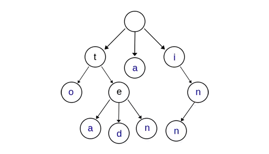

## Project: research report on MPT

MPT (Merkle Patricia Tries) 是以太坊存储数据的核心数据结构，它是由 Merkle Tree 和 Patricia Tree 结合的一种树形结构，理解 MPT 有助于我们更好的理解以太坊的数据存储。

在了解 MPT 数据结构之前，需要先介绍基本的 Tree 结构和 Merkle Tree、Patricia Tree。

#### Trie

Trie 树，又称前缀树或字典树，是一种有序树，用于保存关联数组，其中的键通常是字符串。一个节点的所有子孙都有相同的前缀，也就是这个节点对应的字符串，而根节点对应空字符串。Trie的核心思想就是用空间换时间，利用公共前缀缩小要比较的范围来达到快速查找的目的。

相比于哈希表，使用前缀树来进行查询拥有共同前缀key的数据时十分高效，例如在字典中查找前缀为pre的单词，对于哈希表来说，需要遍历整个表，时间效率为O(n)，然而对于前缀树来说，只需要在树中找到前缀为pre的节点，且遍历以这个节点为根节点的子树即可。

但是对于最差的情况（前缀为空串)，时间效率为O(n),仍然需要遍历整棵树，此时效率与哈希表相同。

相比于哈希表，在前缀树不会存在哈希冲突的问题。

上图是一棵 Trie 树，表示了字符串集合{“a”, “to”, “tea”, “ted”, “ten”, “i”, “in”, “inn”} ，从上图中我们可以看出Trie树的特点：

- 根节点不包含字符，除根节点外的每一个子节点都包含一个字符。
- 从根节点到某一个节点，路径上经过的字符连接起来，为该节点对应的字符串。
- 每个节点的所有子节点包含的字符互不相同。

然而，这样的结构存在缺陷。当存在少量的长字符串，且其某个较长前缀下只有本身一个元素时，树的高度会很大，且一条长路径上只有一个叶节点。这样极大地浪费了存储空间，且应用起来效率也不高。下图展示了这样的状态：

为了解决这个问题，产生了Patricia 树 (压缩前缀树)。

#### Patricia Trie

压缩前缀树，是一种更节省空间的 Trie。对于树的每个节点，如果该节点是唯一的子节点，就和父节点合并。

#### Merkle Tree

Merkle树，主要用于数据集较大时的文件校验。其主要特点为：

- 叶节点存储数据块的 Hash（如：文件块、一段数据集）
- 非叶子节点 (包括中间节点和根节点) 存储着对应子节点 Hash 值串联字符串之后的 Hash 值。

从上图中可以看出：

- 在最底层，和哈希列表一样，我们把数据分成小的数据块，有相应地哈希和它对应；
- 往上走，并不是直接去运算根哈希，而是把相邻的两个哈希合并成一个字符串，然后运算这个字符串的哈希。
- 最终到达根节点，生成了可以代表整棵树的hash值，该节点成为叫做 Merkle Root。

该数据结构的应用可以通过一个实例理解。

在 P2P 下载中，文件会切分成很多小的数据块，每个数据块从不同的来源上下载，这些来源可能是不稳定或不可信的。文件下载完成后，需要校验文件完整性。

以往一般的做法是对于整个文件计算hash值并与正确的值进行对比。然而这需要完整地下载整个文件，并且一旦产生错误，也很难找出是哪一个部分出现问题，这使得下载的可靠性和效率都很差。而Merkle Tree就可以解决这个问题。

在P2P网络下传输文件之前，先从可信的源获得文件的Merkle Root，然后就可以从其他不可信的源获取Merkle tree。通过可信的Merkle Root来验证Merkle tree是否损坏或者是虚假的。文件合并之后，计算小数据块的 Hash 并最终计算根 Hash，对比与可信的根 Hash 是否一致。这样就避免了对整个文件进行 Hash 计算。

------

了解了这些基本概念，下面可以开始讨论报告的主题：MPT。

MPT，即Merkle Patricia Tree。是一种经过改良的、融合了默克尔树和前缀树两种树结构优点的数据结构，是以太坊中用来组织管理账户数据、生成交易集合哈希的重要数据结构。

MPT树有以下几个作用：

- 存储任意长度的key-value键值对数据，符合以太坊的state模型；
- 提供了一种快速计算所维护数据集哈希标识的机制；
- 提供了快速状态回滚的机制；
- 提供了默克尔证明，进行轻节点的扩展，实现简单支付验证；

MPT树中的节点包括空节点、叶子节点、扩展结点和分支节点。

1、空节点（NULL）：表示为空，在代码中是一个空串。

2、叶子节点（leaf）：表示为 [key,value]的一个键值对，其中key是key的一种特殊十六进制编码(MP编码)， value是value的RLP编码。

3、拓展节点（extension）：也是[key,value],但是这里的value是其他节点的hash，通过这个hash链接到其他节点。

4、分支节点（branch）：MPT中的key被序列化成一种特殊的16进制编码，加上最后的value，所以分支节点是一个长度为17的list，前16个元素对应着key中的16个可能的十六进制字符。如果有一个[key,value]对在这个分支节点终止，则最后一个元素代表一个值（例如，有三个key，分别是（abc，abd，ab），则该节点的第17个字段存储了ab节点的值）即分支节点既可以是搜索路径的终止也可以是路径的中间节点。对应于Trie中的关键路径节点。

MPT中另外一个重要的概念是一个特殊的十六进制前缀(hex-prefix, HP)编码，用来对key进行编码。这种编码使用十六进制字符串，因此前缀的字母表也是16进制，每个节点可能有16个子节点。

**HEX-Prefix 十六进制前缀编码**：

- 若输入key结尾为0x10，则去掉这个终止符。
- key之前填充一个二进制四元组，第0位区分奇偶信息，第1位区分节点类型。
- 如果输入key的长度是偶数，则再添加一个四元组0x0在flag四元组后。
- 将原来的key内容压缩，将分离的两个hex以高四位低四位进行合并成一个字节。

此外，注意到叶节点和扩展节点的存储结构完全相同。为了将 MPT 树存储到数据库中，同时还可以把MPT树从数据库中恢复出来，对于 Extension 和 Leaf 的节点类型做了特殊的定义：**如果是一个扩展节点，那么前缀为0，这个0加在 key 前面。如果是一个叶子节点，那么前缀就是1**。

#### MPT结构

MPT树的特点如下:

- 叶子节点和分支节点可以保存value, 扩展节点保存key；
- 没有公共的key就成为2个叶子节点；key1=[1,2,3] key2=[2,2,3]
- 有公共的key需要提取为一个扩展节点；key1=[1,2,3] key2=[1,3,3] => ex-node=[1],下一级分支node的key
- 如果公共的key也是一个完整的key，数据保存到下一级的分支节点中；key1=[1,2] key2=[1,2,3] =>ex-node=[1,2],下一级分支node的key; 下一级分支=[3],上一级key对应的value

使用MPT的主要原因在于一个问题：设计在扩展节点的Val字段有可能存储一串哈希值作为孩子节点的索引，这一点符合Trie的特性。

在以太坊中，该哈希代表着另外一个节点在数据库中索引，即根据这个哈希值作为数据库中的索引，可以从数据库中读取出另外一个节点的内容。

这种设计的目的是：

（1）当整棵树被持久化到数据库中时，保持节点间的关联关系；

（2）从数据库中读取节点时，尽量避免不必要的IO开销；

在内存中，父节点与子节点之间关联关系可以通过引用、指针等编程手段实现，但是当树节点持久化到数据库是，父节点中会存储一个子节点在数据库中的索引值，以此保持关联关系。

同样，从数据库中读取节点时，本着最小IO开销的原则，仅需要读取那些需要用到的节点数据即可，因此若目前该节点已经包含所需要查找的信息时，便无须将其子节点再读取出来；反之，则根据子节点的哈希索引递归读取子节点，直至读取到所需要的信息。

##### 特点

MPT结合了Merkle Tree和Patricia Trie的优势，概括如下：

可以实现快速重哈希，当树节点内容发生变化时，能够在前一次哈希计算的基础上，仅仅将被修改的树节点进行哈希重计算，便能得到一个新的根哈希用来代表整棵树的状态。

仍然可以进行轻节点扩展，验证一条交易只需要验证包含该交易的路径即可，并不需要把所有交易的Hash全部重新算一遍。

能够实现快速状态回滚。区块链公链的环境下，可能会造成分叉而导致区块链状态需要进行回滚，由于出块时间短，这种分叉的几率很大，区块链状态回滚的现象很频繁。所谓的状态回滚指的是：（1）区块链内容发生了重组织，链头发生切换（2）区块链的世界状态（账户信息）需要进行回滚，即对之前的操作进行撤销。

每个节点在数据库中的存储都是值驱动的。当一个节点的内容发生了变化，其哈希相应改变，而MPT将哈希作为数据库中的索引，也就实现了对于每一个值，在数据库中都有一条确定的记录。而MPT是根据节点哈希来关联父子节点的，因此每当一个节点的内容发生变化，最终对于父节点来说，改变的只是一个哈希索引值；父节点的内容也由此改变，产生了一个新的父节点，递归地将这种影响传递到根节点。最终，一次改变对应创建了一条从被改节点到根节点的新路径，而旧节点依然可以根据旧根节点通过旧路径访问得到。所以，在以太坊中，发生分叉而进行世界状态回滚时，只需要用旧的MPT根节点作为入口，就能完成一次“状态回滚”。

