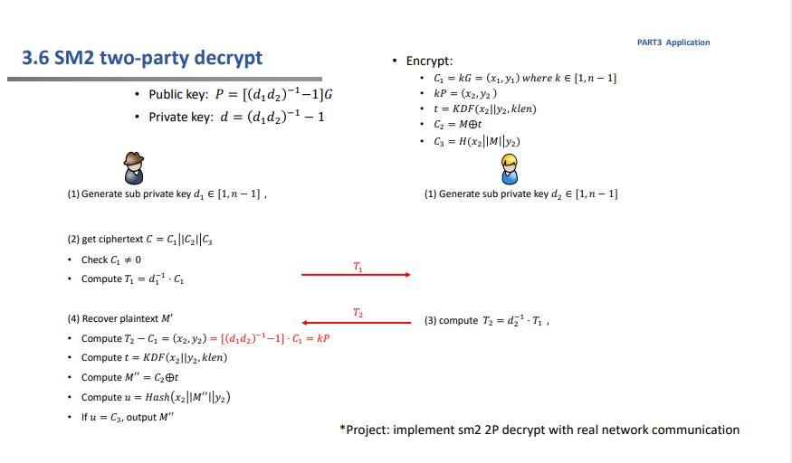
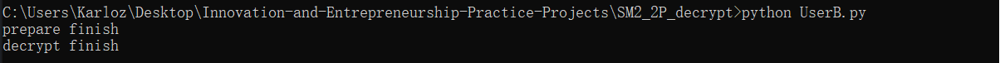
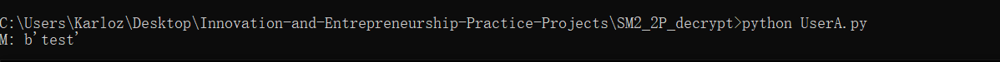

### Project: implement sm2 2P decrypt with real network communication

#### 代码说明

使用socket网络编程实现真实网络交互下的两方解密。

由于是真实网络场景，因此需要分别设计两个用户的行为。

这里以UserA作为一切交互的发起方，UserB监听端口做出应答。

整体算法流程见下图。



首先A需要与B协商共同的公钥，此阶段称为prepare。

由A发起一系列运算，生成自身的私钥，计算$P_1$发送给B。

```python
# 协商共用的公钥以及各自私钥
mode = 'prepare'
s.send(mode.encode())

d_1 = random.randint(1, n - 1)
P_1 = inv_mod(d_1, p) * G
s.send((int2str(P_1.x) + int2str(P_1.y)).encode())
data = s.recv(1024).decode()
P = Point(E, int(data[:64], 16), int(data[64:128], 16))
```

B根据mode指定的需求做出应答。

首先接收$P_1$。计算自己的私钥，生成$P_2$，计算$P=d_2^{-1}*P_1+n*G\ (mod\ p)$，将P发送给A。

```python
def prepare(sock, addr):
    data = sock.recv(1024).decode()
    P_1 = Point(E, int(data[:64], 16), int(data[64:128], 16))
    nG = Point(E, G.x, p - G.y)
    P = inv_mod(d_2, p) * P_1 + nG
    sock.send((int2str(P.x) + int2str(P.y)).encode())
    print("prepare finish")
```

该阶段完成后，双方各自计算得到了同样的公钥P。

------

然后，A使用公钥P加密一段信息，得到密文。

```python
k = random.randint(1, n - 1)
C_1 = k * G
kP = k * P
t = KDF(int2str(kP.x) + int2str(kP.y), 128)
C_2 = xor(int.from_bytes(M.encode(), byteorder='big'), int(t, 16))
C_3 = Hash(int2str(kP.x) + M + int2str(kP.y))
C = (C_1, C_2, C_3)
```

为了解密，A需要向B提出合作解密的请求。

```python
# decrypt
mode = 'decrypt'
s.send(mode.encode())
T_1 = inv_mod(d_1, p) * C_1
s.send((int2str(T_1.x) + int2str(T_1.y)).encode())
data = s.recv(1024).decode()
T_2 = Point(E, int(data[:64], 16), int(data[64:128], 16))

nC_1 = Point(E, C_1.x, p - C_1.y)
kP = T_2 + nC_1
t = KDF(int2str(kP.x) + int2str(kP.y), 128)
M = bytes.fromhex(int2str(xor(C_2, int(t, 16))))
```

同理，B做出回复：

```python
def decrypt(sock, addr):
    data = sock.recv(1024).decode()
    T_1 = Point(E, int(data[:64], 16), int(data[64:128], 16))
    T_2 = inv_mod(d_2, p) * T_1
    sock.send((int2str(T_2.x) + int2str(T_2.y)).encode())
    print("decrypt finish")
```

最终，A可以获得明文M。

------

#### 运行结果

输出最终解密结果。





#### 运行指导

先运行UserB.py，监听特定端口并做出回应。

然后运行UserA.py即可。在UserA的终端会打印输出签名值，UserB无回显。