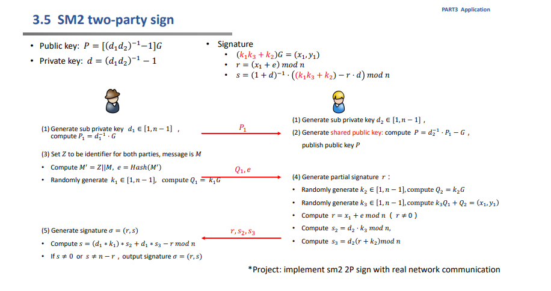
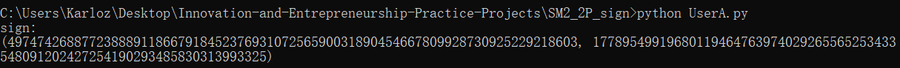

### Project: implement sm2 2P sign with real network communication

#### 代码说明

使用socket网络编程，在真实网络场景下实现两方签名。

算法流程见下图

分别实现了用户A和B的不同行为以实现交互，具体交互过程和图中完全一致，不再过多解释。

#### 运行结果

最终得到签名值并输出。

#### 运行指导

先运行UserB.py，监听端口。

再运行UserA.py即可。