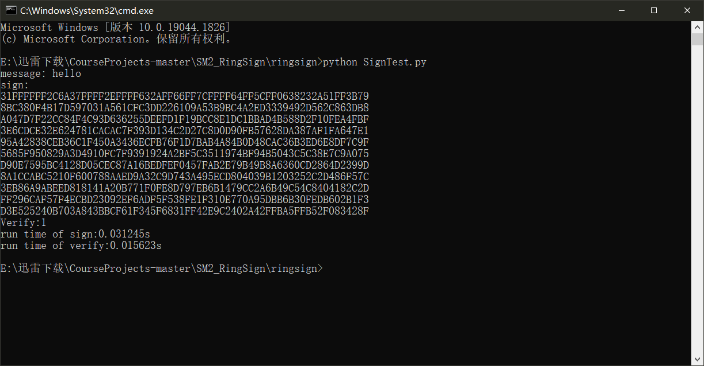

### SM2环签名

本项目不属于课程明确要求的项目内容，但结合了SM2加密算法、数字签名、OpenSSL应用等多个方面的知识，与课程内容以及要求的项目有极大相关。结合其它课程、竞赛等的需要，实现了基于SM2算法的环签名方案。

该项目用于代替要求项目中未完成的题目。

#### 代码说明

首先说明项目所使用的算法流程。见下图：


基本的参数与SM2加密类似，基于椭圆曲线。

```c
const char* P = "FFFFFFFEFFFFFFFFFFFFFFFFFFFFFFFFFFFFFFFF00000000FFFFFFFFFFFFFFFF";
const char* A = "FFFFFFFEFFFFFFFFFFFFFFFFFFFFFFFFFFFFFFFF00000000FFFFFFFFFFFFFFFC";
const char* B = "28E9FA9E9D9F5E344D5A9E4BCF6509A7F39789F515AB8F92DDBCBD414D940E93";
const char* GX = "32c4ae2c1f1981195f9904466a39c9948fe30bbff2660be1715a4589334c74c7";
const char* GY = "bc3736a2f4f6779c59bdcee36b692153d0a9877cc62a474002df32e52139f0a0";
const char* N = "FFFFFFFEFFFFFFFFFFFFFFFFFFFFFFFF7203DF6B21C6052B53BBF40939D54123";
```

------

本项目的实现基于OpenSSL提供的大整数库BIGNUM以及椭圆曲线相关实现EC。

首先定义一个SM2环签名类，用于表示一次签名的主体。各个参数的意义见注释。

```c
class SM2RingSign
{
public:
	int SIZE,ID;// 签名集合个数、用户ID
	#pragma warning(suppress : 4996)
	EC_GROUP* ecGroup = EC_GROUP_new(EC_GFp_mont_method());// 椭圆曲线群E
	BN_CTX* ctx = BN_CTX_new();
	EC_POINT* G = EC_POINT_new(ecGroup);// 基点
	BIGNUM* order = BN_new();
	BIGNUM** S = NULL;
	string* PK = NULL;// 公钥集合
	string pk, sk;// 节点公私钥
	int index = -1;
	
	SM2RingSign(int size,int id) {
		this->SIZE = size;
		this->ID = id;
		this->S = new BIGNUM * [SIZE];
		this->PK = new string[SIZE];
	}

	void init();
	void setKey();
	void readPK();
	string getOrder();
	void genS();
	EC_POINT* getPoint(BIGNUM* x, BIGNUM* y);
	string point2hex(EC_POINT* pt);
	BIGNUM* H(string* PK, string msg, string Z);
	BIGNUM* culc_s(BIGNUM* k, BIGNUM* sk, BIGNUM* Ci);
	string culc_z(string pk, BIGNUM* Ci, BIGNUM* Si);
	BIGNUM** Sign(string msg);
	bool Verify(string msg, BIGNUM** sign);
};
```

------

下面将分别介绍各个函数的实现。

##### genS

根据算法要求，我们在每一次运算时均需要随机生成一个$s_i$。这个过程可以在类的初始化时就提前完成，也即先得到所有的s，存在类的S数组中。

```c++
inline void SM2RingSign::genS()
{
	int ret = -1;
	BIGNUM* rand = BN_new(), * temp = BN_new();

	char* res = NULL;
	for(int i= 0;i<SIZE;i++)
	{
		while (1)
		{
			ret = BN_rand_range(rand, order);
			ret = BN_gcd(temp, rand, order, ctx);
			if (BN_is_one(temp))break;
		}
		S[i] = BN_dup(rand);
	}
	BN_free(rand);
	BN_free(temp);
}
```

我们使用BIGNUM中的BN_rand_range方法生成$Z_n$中的一个大随机数，再利用gcd判断是否互素。最终产生$Z_n^*$中的随机数，保存起来。

##### Hash函数

openssl同样提供了很多hash函数的接口。比如在openssl/sha.h中就可以找到SHA256的定义及应用。本项目中使用该算法作为hash函数的基础。

为了方便数据的级联，所有数据的存储方式均是十六进制字符串的形式。而明文消息则以普通字符串形式存储，因此在进行级联之前需要先将每个字节转化成十六进制串，再将所有数据加在一起，作为SHA256的输入。最终返回保存结果的数组。

```c
inline BIGNUM* SM2RingSign::H(string* PK, string msg, string Z)
{
	string hex_msg = str2hex(msg, msg.length());
	string dst,data;
	for (int i = 0; i < SIZE;i++)
		data+=PK[i];
	data += hex_msg;
	data += Z;

	unsigned char md[33];
	memset(md, 0, 33);
	SHA256((const unsigned char*)data.c_str(), data.length(), md);
	for (int i = 0; i < 32; i++)
	{
		dst+=(char)md[i];
	}
	dst = str2hex(dst,32);
	BIGNUM* hash = BN_new();
	BN_hex2bn(&hash, dst.c_str());
	int l1 = dst.length(), l2 = data.length();
	BN_mod(hash, hash, order, ctx);

	return hash;
}
```

------

然后分别实现$Z_i,s_i,c_i$的计算。

实现方法就是使用openssl提供的大数运算和椭圆曲线运算的接口来实现算法流程中的计算。原理完全依照算法描述，很容易理解，不再赘述。详情可以查看源代码中如下函数的定义。

```c++
	BIGNUM* culc_s(BIGNUM* k, BIGNUM* sk, BIGNUM* Ci);
	string culc_z(string pk, BIGNUM* Ci, BIGNUM* Si);
```

##### 签名生成

最后将所有组件组合在一起，对于$i=\pi+1,\pi+2,\ldots,n,1,\ldots,\pi-1$依次计算$Z_i,c_i$，最后计算$s_\pi$，输出$c_1,s_1,s_2,\ldots,s_n$作为签名值。

```c++
inline BIGNUM** SM2RingSign::Sign(string msg)
{
	int retval = 0;
	BIGNUM** C = new BIGNUM * [SIZE];
	for(int i = 0;i < SIZE;i++)
		C[i] = BN_new();
	int index = 0;
	for (int i = 0; i < SIZE; i++) {
		if (this->PK[i] == this->pk)
			index = i;
	}

	BIGNUM* k = BN_new(), * temp = BN_new();
	BN_rand_range(k, order);
	char* res = NULL;
	while (1)
	{
		BN_rand_range(k, order);
		BN_gcd(temp, k, order, ctx);
		if (BN_is_one(temp))break;
	}
	EC_POINT* kg = EC_POINT_new(ecGroup);
	retval = EC_POINT_mul(ecGroup, kg, NULL, G, k, ctx);

	BIGNUM* bn = H(this->PK, msg, point2hex(kg));
	C[(index + 1) % SIZE] = bn;
	for (int i = (index + 1)%SIZE; i != index; i = (i + 1) % SIZE)
	{
		string Zi = culc_z(this->PK[i], C[i], S[i]);
		C[(i + 1)%SIZE] = H(this->PK, msg, Zi);
	}
	BIGNUM* Sk = BN_new();
	BN_hex2bn(&Sk, sk.c_str());
	S[index] = culc_s(k, Sk, C[index]);
	BIGNUM** ret = new BIGNUM * [SIZE + 1];
	ret[0] = BN_dup(C[0]);
	for(int i = 0;i < SIZE;i++)
		ret[i + 1] = BN_dup(S[i]);

	BN_free(k); BN_free(temp); BN_free(Sk); EC_POINT_free(kg);
	for (int i = 0; i < SIZE; i++)BN_free(C[i]);
	delete[]C;
	return ret;
}
```

------

##### 签名验证

以签名值sign作为输入。sign表现为n+1个元素的BIGNUM数组。

依次计算$Z_i',c_i'$，最后比对$c_1'$和$c_{n+1}$是否相等，作为签名是否合法的判断依据。由于c语言数组从0开始计数，这里比较的是c[0]和c[n]。

```c++
inline bool SM2RingSign::Verify(string msg, BIGNUM** sign)
{
	BIGNUM** C_ = new BIGNUM * [SIZE + 1];
	for(int i = 0; i < SIZE + 1; i++)C_[i] = BN_new();
	C_[0] = sign[0];
	for (int i = 0; i < SIZE;i++)
		BN_set_word(C_[i + 1], 0);
	BIGNUM** S_ = new BIGNUM * [SIZE];
	for (int i = 0; i < SIZE; i++) {
		S_[i] = sign[i + 1];
	}
	BIGNUM* temp = BN_new();
	char* res;
	for(int i = 0; i < SIZE;i++)
	{
		BN_gcd(temp, C_[i], order, ctx);
		res = BN_bn2dec(temp);
		if (strlen(res) != 1 || res[0] != '1')
			return false;
		string Zi = culc_z(PK[i], C_[i], S_[i]);
		C_[i + 1] = H(PK, msg, Zi);
		//printf("Ci : %d ,%s \n", (i + 1) , BN_bn2hex(C_[(i + 1)]));
	}
	if (BN_cmp(C_[0], C_[SIZE]))
	{
		for (int i = 0; i < SIZE; i++){
			BN_free(C_[i]);
			BN_free(S_[i]);
		}
		delete[]C_;
		return false;
	}
	for (int i = 0; i < SIZE; i++) {
		BN_free(C_[i]);
		BN_free(S_[i]);
	}
	delete[]C_;
	return true;
}
```

#### 运行结果

生成10个公钥作为签名使用的公钥集合。选择第一组公私钥作为签名主体，生成一个环签名。并进行验证算法，查看正确性。

为了方便测试脚本调用，我们使用命令行传参。

```c++
/*
* argument[1] RingSize:num of PK
* argument[2] Id: identification
* argument[3] Mode: Sign->0 Vertify->1
* argument[4] Msg
* argument[5] Signature
*/
int main(int argc, char* argv[])
```

然后编写测试程序。

在这里，我们首先使用python的subprocess调用环签名程序，传入参数列表，生成一个签名。并将输出的结果保存起来。

然后将保存的签名值作为参数添加到命令行参数列表中，再次调用环签名程序，执行签名验证模式，查看签名生成以及验证是否正确。

```python
from subprocess import *
import time

size = '10'
key_id = '0'
msg = 'hello'

start=time.time()
p1 = run(['./ringsign.exe',size,key_id,'0',msg],capture_output=True)
end=time.time()
t1=end-start


print('message:',msg)
sign = str(p1.stdout)[7:-2].split(' ')
print('sign:')
for i in sign:
    print(i)
arg = ['./ringsign.exe',size,key_id,'1',msg]
for i in sign:
    arg.append(i)

start=time.time()
p2 = run(arg,capture_output=True,check=True)
end=time.time()
t2=end-start

print(str(p2.stdout)[2:-1])

print('run time of sign:%fs'% t1)
print('run time of verify:%fs'% t2)
```

最终结果见下图：


可以看到，成功的生成了符合要求的签名值，并且通过了验证。算法实现正确。

同时，关联10个节点的签名执行一次只需要0.04s，效率极高，优化效果明显。

#### 运行指导

在该项目文件夹SM2_RignSign下，进入Debug子文件夹。


可以看到前面编写的测试脚本。


在该文件夹下，进入cmd，执行python脚本即可出现运行结果。




由于使用了测试脚本来进行命令行传参，整个过程不需要进入visual studio项目，也不需要进行编译连接。并且由于命令行传参的特性，不能在vs工程项目中执行代码，会出现错误。

因此只需要按照前面的指导运行python脚本，调用经过的测试的功能正常的可执行程序。