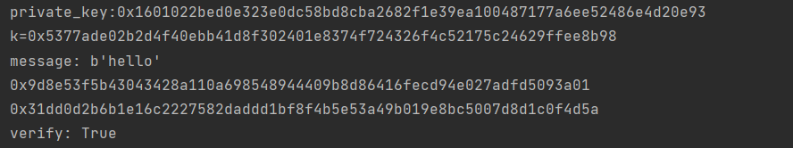

### project: impl sm2 with RFC6979

#### 代码说明

RFC6979文档中关于确定性产生k的方法如下：

```
Given the input message m, the following process is applied:

   a.  Process m through the hash function H, yielding:

          h1 = H(m)

       (h1 is a sequence of hlen bits).

   b.  Set:

          V = 0x01 0x01 0x01 ... 0x01

       such that the length of V, in bits, is equal to 8*ceil(hlen/8).
       For instance, on an octet-based system, if H is SHA-256, then V
       is set to a sequence of 32 octets of value 1.  Note that in this
       step and all subsequent steps, we use the same H function as the
       one used in step 'a' to process the input message; this choice
       will be discussed in more detail in Section 3.6.
  c.  Set:

          K = 0x00 0x00 0x00 ... 0x00

       such that the length of K, in bits, is equal to 8*ceil(hlen/8).

   d.  Set:

          K = HMAC_K(V || 0x00 || int2octets(x) || bits2octets(h1))

       where '||' denotes concatenation.  In other words, we compute
       HMAC with key K, over the concatenation of the following, in
       order: the current value of V, a sequence of eight bits of value
       0, the encoding of the (EC)DSA private key x, and the hashed
       message (possibly truncated and extended as specified by the
       bits2octets transform).  The HMAC result is the new value of K.
       Note that the private key x is in the [1, q-1] range, hence a
       proper input for int2octets, yielding rlen bits of output, i.e.,
       an integral number of octets (rlen is a multiple of 8).

   e.  Set:

          V = HMAC_K(V)

   f.  Set:

          K = HMAC_K(V || 0x01 || int2octets(x) || bits2octets(h1))

       Note that the "internal octet" is 0x01 this time.

   g.  Set:

          V = HMAC_K(V)

   h.  Apply the following algorithm until a proper value is found for
       k:

       1.  Set T to the empty sequence.  The length of T (in bits) is
           denoted tlen; thus, at that point, tlen = 0.

       2.  While tlen < qlen, do the following:

              V = HMAC_K(V)

              T = T || V
       3.  Compute:

              k = bits2int(T)

           If that value of k is within the [1,q-1] range, and is
           suitable for DSA or ECDSA (i.e., it results in an r value
           that is not 0; see Section 3.4), then the generation of k is
           finished.  The obtained value of k is used in DSA or ECDSA.
           Otherwise, compute:

              K = HMAC_K(V || 0x00)

              V = HMAC_K(V)

           and loop (try to generate a new T, and so on).

   Please note that when k is generated from T, the result of bits2int
   is compared to q, not reduced modulo q.  If the value is not between
   1 and q-1, the process loops.  Performing a simple modular reduction
   would induce biases that would be detrimental to signature security.
```

根据此文档，使用python，通过hmac，hashlib等库函数实现k的生成部分。参考资料实现了轻量化的椭圆曲线库Curve实现sm2的计算，并应用于后续项目。最终实现了签名值的生成并检查了验证的正确性。

参考文档内容，编写生成k的函数：

```python
def deterministic_generate_k(msghash, sk):
    v = b'\x01' * 32
    k = b'\x00' * 32

    sk = encode_privkey(sk, 'bin')

    msghash = encode(hash_to_int(msghash), 256, 32)

    # K = HMAC_K（V || 0x00 || int2octets（x）|| bits2octets（h1））
    k = hmac.new(k, v + b'\x00' + sk + msghash, hashlib.sha256).digest()
    # V = HMAC_K（V）
    v = hmac.new(k, v, hashlib.sha256).digest()
    # K = HMAC_K（V || 0x01 || int2octets（x）|| bits2octets（h1））
    k = hmac.new(k, v + b'\x01' + sk + msghash, hashlib.sha256).digest()
    # V = HMAC_K（V）
    v = hmac.new(k, v, hashlib.sha256).digest()

    # 若结果不在[1,q-1]范围中，则重复迭代
    while True:
        v = hmac.new(k, v, hashlib.sha256).digest()
        T = v
        res = decode(T, 256)
        if 1 <= decode(T, 256) <= q - 1:
            return res
        k = hmac.new(k, v + b'\x00', hashlib.sha256).digest()
        v = hmac.new(k, v, hashlib.sha256).digest()
```

------

得到k后，正常的构建sm2签名体系。

```python
def sign(msg, ID_str, d_A):
    Z_A = encode(ENTL, 16) + ID_str + encode(a, 16) + encode(b, 16) + encode(x_G, 16) + encode(y_G, 16) + encode(P_A.x,
                                                                                                                 16) + encode(
        P_A.y, 16)
    Z_A = hashlib.sha256(Z_A.encode()).hexdigest()
    M = Z_A + encode(decode(msg, 256), 16)
    e = decode(hashlib.sha256(M.encode()).hexdigest(), 16)
    kG = k * G
    r = (e + kG.x) % n
    s = (inv_mod(1 + d_A, n) * (k - r * d_A)) % n
    return r, s


def verify(msg, r, s, ID_str):
    Z_A = encode(ENTL, 16) + ID_str + encode(a, 16) + encode(b, 16) + encode(x_G, 16) + encode(y_G, 16) + encode(P_A.x,
                                                                                                                 16) + encode(
        P_A.y, 16)
    Z_A = hashlib.sha256(Z_A.encode()).hexdigest()
    M = Z_A + encode(decode(msg, 256), 16)
    e = decode(hashlib.sha256(M.encode()).hexdigest(), 16)
    t = (r + s) % n
    pt = s * G + t * P_A
    R = (e + pt.x) % n
    return R == r
```

使用的参数为：

```python
q = 0x8542D69E4C044F18E8B92435BF6FF7DE457283915C45517D722EDB8B08F1DFC3
a = 0x787968B4FA32C3FD2417842E73BBFEFF2F3C848B6831D7E0EC65228B3937E498
b = 0x63E4C6D3B23B0C849CF84241484BFE48F61D59A5B16BA06E6E12D1DA27C5249A
x_G = 0x421DEBD61B62EAB6746434EBC3CC315E32220B3BADD50BDC4C4E6C147FEDD43D
y_G = 0x0680512BCBB42C07D47349D2153B70C4E5D7FDFCBFA36EA1A85841B9E46E09A2
n = 0x8542D69E4C044F18E8B92435BF6FF7DD297720630485628D5AE74EE7C32E79B7
```

随机生成$d_A \in [2,q-1]$作为私钥，$P=d_A\cdot G$生成一条签名并进行签名验证。

#### 运行结果

最终签名及验证结果见下图：



##### 运行指导

在本项目文件夹SM2_with_RFC6979下，命令行使用python运行main.py。