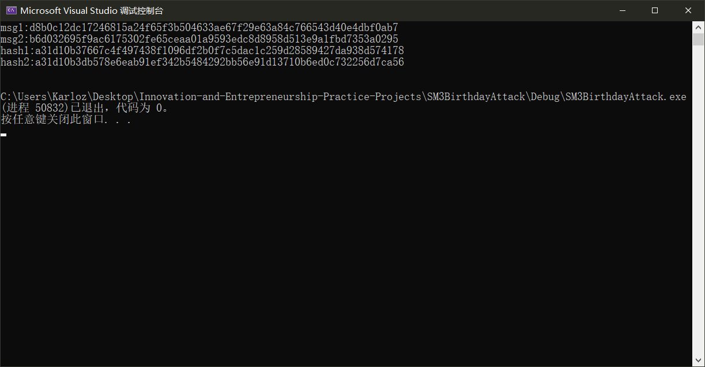

### Project: implement the naïve birthday attack of reduced SM3

实现了基本的对于SM3哈希算法的生日攻击，并在可接受的时间内找到了32位的碰撞。

事实上，使用c语言实现的生日攻击在性能较强的个人计算机上能够在可接受的时间内完成64位碰撞的搜索。**但是由于内存的限制，如果寻找64位碰撞，则需要搜索$2^{32}$个512bit消息，消耗的存储空间远远超出了个人计算机的承受范围，不能实现。**

因此最终选择了32位。

#### 代码说明

设定寻找碰撞的长度为32位。

根据生日攻击的原理，需要随机搜索$2^{16}$个明文消息，计算其hash值并保存起来。最后对于整个集合进行排序，从头到尾查找是否有相同的两项。

首先规定搜索上界。

```c++
const int length = 32;
const ll upperbound = pow(2, length >> 1);
```

规定集合中元素：

```c++
struct setNode
{
	uchar msg[65];
	int c32;
	ll c64;
	setNode() { memset(msg,0,sizeof(msg)); c32 = 0; c64 = 0; };
	bool operator < (const setNode other)const
	{
		return this->c64 < other.c64;
	}
};
```

其中，msg保存明文消息，c32，c64分别以整数形式保存hash值的前32位和前64位，这样做可以方便进行排序和比对。

然后，重载运算符，使得整个结构以前64位的数值作为排序依据，从小到大排列。

------

sm3的明文输入是512bit，即64B作为一个分组。由于其存在填充规则，512位的明文实际上会被扩充至两个分组。因此为了将输入长度限制在一个分组，我们只生成32B的明文消息。

```c++
inline void randBN(uchar* dst, int len)//len个byte
{
	FOR(i, 0, len)dst[i] = rand() % 256;
}
```

使用随机数生成单个字节来随机生成整个指定长度的字节串。

然后就可以开始搜索$2^{16}$组明文。

当搜索完成后，对于记录的数据按照hash值排序，查找是否有相同的项。由于我们这里选择寻找32位碰撞，因此比对的是c32。

```c++
FOR(i, 0, upperbound)
		{
			randBN(rec[i].msg, 32);
			sm3(&ctx, rec[i].msg, 32, h);
			rec[i].c64 = bytes2long(h);
			rec[i].c32 = bytes2int(h);
		}

		sort(rec, rec + upperbound);

		FOR(i, 0, upperbound)if (rec[i].c32 != 0 && rec[i].c32 == rec[i + 1].c32)
		{
			printf("msg1:"); printhex(rec[i].msg, 32);
			printf("msg2:"); printhex(rec[i + 1].msg, 32);

			uchar h1[33], h2[33];
			memset(h1, 0, sizeof(h1)); memset(h2, 0, sizeof(h2));
			sm3(&ctx, rec[i].msg, 32, h1); sm3(&ctx, rec[i + 1].msg, 32, h2);

			printf("hash1:"); printhex(h1, 32);
			printf("hash2:"); printhex(h2, 32);
			puts("");

			flag = 1;
			break;
		}
```

为了节省时间，只要发现一对碰撞就停止搜索。

另外需要注意的是：**由于生日攻击只能保证有50%的概率找到一对碰撞，所以只执行一次攻击可能并不能找到碰撞。**

为了确保能得到答案，如果找不到碰撞，就重新执行一次整个攻击过程，直到找到一组碰撞。每次的成功概率是50%，因此最后重复执行的总次数不会很多。

#### 运行结果

执行程序，如果发现碰撞，则打印两条消息的明文及其hash值。如下图所示，四行数据的含义分别是：第一条消息明文，第二条消息明文，第一条消息hash值，第二条消息hash值。

可以看到，两个hash值的前8个字符完全相同。而16进制下每个字符代表4bit，也就是我们找到了一组32位的碰撞。



#### 运行指导

进入本项目文件夹下的SM3BirthdayAttack.sln项目，在vs工程项目中执行源代码即可。

由于可能重复执行几次才能找到答案，需要等待一段时间，但不会很长，大约几秒的时间。