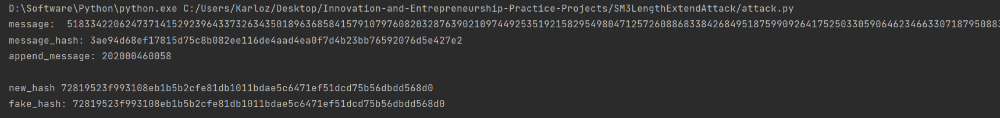

### Project: implement length extension attack for SM3, SHA256, etc.

本项目实现了对于SM3算法的长度扩展攻击。

长度扩展攻击的背景是，为了安全性，某些hash函数添加了salt属性，其作用类似于密钥，作用于hash函数使得其产生不同的结果。如果不知道salt或其它类似的秘密信息，其他人不能计算出hash值。而如果使用长度扩展，则可以根据一组已知的消息哈希对来生成一个扩展消息，并能够计算出这个消息的hash值。

本项目就是实现了这样的效果。

#### 代码说明

项目使用了gmssl提供的sm3方法。

首先生成正确信息：

```python
# 原始消息及其hash值
message = str(random.randint(10 ** 200, 10 ** 201))
message_hash = sm3.sm3_hash(func.bytes_to_list(bytes(message, encoding='utf-8')))
```

选定扩展的有意义的信息，这里使用了自己的学号。

```python
# 附加消息
append_m = "202000460058"
```

长度扩展攻击的原理类似于加密的CBC模式，上一个分组计算完成后的状态被用于下一个分组。而为了得到这些信息，修改了库函数来获取状态。

```python
def sm3_hash(msg, vec):
    # print(msg)
    len1 = len(msg)
    reserve1 = len1 % 64
    msg.append(0x80)
    reserve1 = reserve1 + 1
    # 56-64, add 64 byte
    range_end = 56
    if reserve1 > range_end:
        range_end = range_end + 64

    for i in range(reserve1, range_end):
        msg.append(0x00)

    bit_length = len1 * 8
    bit_length_str = [bit_length % 0x100]
    for i in range(7):
        bit_length = int(bit_length / 0x100)
        bit_length_str.append(bit_length % 0x100)
    for i in range(8):
        msg.append(bit_length_str[7 - i])

    #  此处对库函数进行了修改。事实上，只需要得到原消息的hash值和附加信息即可计算出整个串的hash
    group_count = int(round(len(msg) / 64.0)) - 1  # 可以只计算最后一组
    append_msg = msg[group_count * 64:]
    y = sm3_cf(vec, append_msg)
    result = ""
    for i in y:
        result = '%s%08x' % (result, i)
    return result
```

修改之前函数的过程为：顺序处理多个分组，最终得到一组状态，这个状态被用于处理最后一个分组。

而如果我们知道了最后一组计算前的状态，就只需要计算最后一轮，而前面的信息不需要考虑。这就是长度扩展的核心部分。

修改后，我们可以根据vec数组自行控制这种状态。

下面构造攻击方法：

```python
def Length_Extend_Attack(src_hash, append_msg):
    vec = []
    message_len = len(message)

    for i in range(0, len(src_hash), 8):
        vec.append(int(src_hash[i:i + 8], 16))

    # 长度扩展攻击下，通过保存向量状态来得到扩展内容的hash值。而不需要知道前面一段消息的明文，可以随意填充。
    fake_msg = '0' * message_len
    fake_msg = func.bytes_to_list(bytes(fake_msg, encoding='utf-8'))
    fake_msg = padding(fake_msg)  # 将伪造消息填充

    # 利用vec信息对扩展后的消息做hash
    fake_msg.extend(func.bytes_to_list(bytes(append_msg, encoding='utf-8')))
    return gmssl_sm3.sm3_hash(fake_msg, vec)
```

首先我们需要根据sm3的消息扩展规则，将原消息扩展至分组长度的整数倍，这样才能保证结果的一致性。然后进行扩展，产生新的消息。

根据sm3结构，我们控制的状态就是上一个分组的hash值。而前面已经得到了真实消息的hash值，那么可以将其作为参数传入sm3计算过程，令其只处理最后一个分组。这样最终得到了扩展后的信息对应的hash值。

**注意，此时我们是不知道初始的秘密信息的，只是根据长度扩展执行了一轮sm3迭代**。

为了验证哈希的正确性，我们将扩展后的消息直接进行完整的sm3计算，得到正确的哈希值进行比较。

```python
# 长度扩展构造的hash值，不需要知道密钥
fake_hash = Length_Extend_Attack(message_hash, append_m)

# 对扩展消息计算正确的hash
new_msg = func.bytes_to_list(bytes(message, encoding='utf-8'))
new_msg = padding(new_msg)
new_msg.extend(func.bytes_to_list(bytes(append_m, encoding='utf-8')))
new_hash = sm3.sm3_hash(new_msg)

print("message: ", message)
print("message_hash:", message_hash)
print("append_message:", append_m, '\n')

print('new_hash', new_hash)
print("fake_hash:", fake_hash, '\n')

if fake_hash == new_hash:
    print('Attack Success')
else:
    print('Failed')
```

#### 运行结果

最终比对两种方式得到的hash值，结果相同，说明长度扩展攻击有效。



#### 运行指导

需要gmssl库，在命令行执行pip install gmssl。

然后执行attack.py即可。