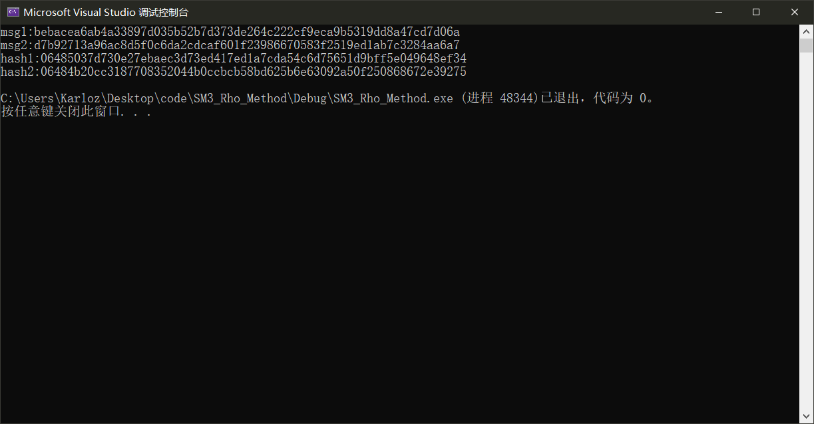

### Project: implement the Rho method of reduced SM3

使用低存储的$\rho$方法实现了SM3的碰撞攻击

#### 代码说明

本项目采取的方案是，初始随机选取明文对$m_1,m_2$。

每次迭代，计算$h_1=Hash(m_1),h_2=Hash(Hash(m_2))$。根据$\rho$方法的原理，最终一定可以成环，找到$h_1=h_2$的情况。

考虑到sm3的输出是32字节，我们设置初始状态也是32字节。

```c++
inline void randBN(uchar* dst, int len)//len��byte
{
	FOR(i, 0, len)dst[i] = rand() % 256;
}
```

```c++
randBN(msg1, 32); randBN(msg2, 32);
```

然后执行迭代：

```c++
		FOR(i, 0, upperbound)
		{
			sm3(&ctx, msg1, 32, h1);

			sm3(&ctx, msg2, 32, temph);
			sm3(&ctx, temph, 32, h2);
			if (!cmp(h1, h2, 2))
			{
				printf("msg1:"); printhex(msg1, 32);
				printf("msg2:"); printhex(temph, 32);
				printf("hash1:"); printhex(h1, 32);
				printf("hash2:"); printhex(h2, 32);
				flag = 1;
				break;
			}
			FOR(i, 0, 32)
			{
				msg1[i] = h1[i];
				msg2[i] = h2[i];
			}
		}
	}
```

如果找到相等的情况，则退出循环，打印信息。

#### 运行结果

实验证明，此方法暂时只能快速找到16位的碰撞。一旦位数增加，所需的时间会很长。分析原因，一方面是因为$\rho$方法采取了低存储的方式，只保存了两种状态。然而这两种状态在环上的距离恰好是1步的情况并不常见，且环可能很大，因此很难在$\sqrt{n}$的次数内找到碰撞；另一方面，sm3的设计必然考虑到了这种攻击方式，其特性应该比较好，足以抵抗攻击。

总而言之，可以在极短的时间内找到16位的碰撞，情况见下图：



#### 运行指导

打开SM3_Rho_Method.sln项目文件进入vs工程项目，执行源代码。