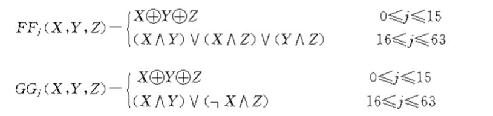
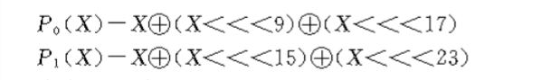
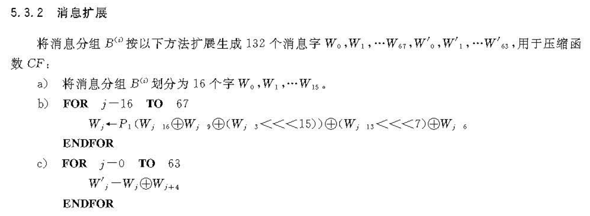
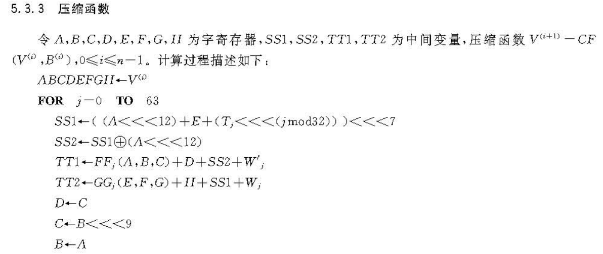
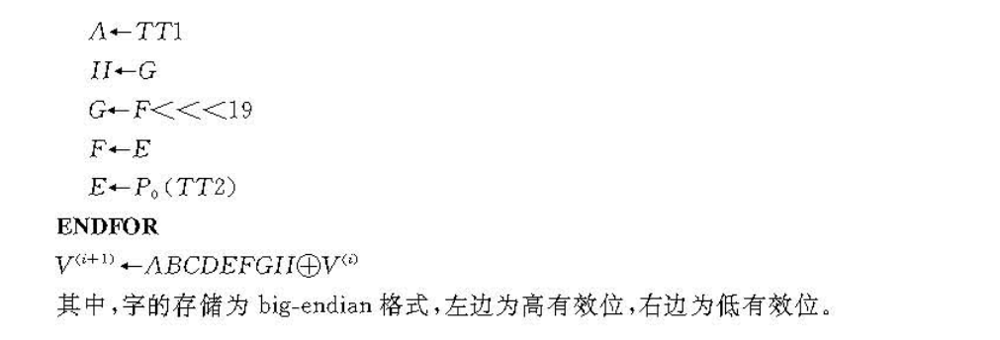
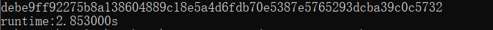

### Project: do your best to optimize SM3 implementation (software)

本项目使用宏定义、SIMD指令集、算法优化等方法实现了对SM3的优化方案。

#### 代码说明

首先根据sm3说明文档，编写各个基本组件。

###### 布尔函数



一个重要的优化策略是利用c语言的宏定义代替函数，这样可以避免函数调用引起的开销，能够有效的提高运行速度。

```c
#define FF0(x,y,z)  (x ^ y ^ z)
#define FF1(x,y,z)  ((x & y) | (x & z) | (y & z))

#define GG0(x,y,z)  (x ^ y ^ z)
#define GG1(x,y,z)  ((x & y) | ((~x) & z))
```

------

###### 置换函数



###### 消息扩展



注意到，上面的过程均是对于32位字进行独立的操作，相互之间并没有依赖关系，因此可以使用SIMD同时处理多组数据。

但重点在于，消息扩展中使用了w[j-3]，w[j-6] ... 来计算w[j]。跨度最小的是当前位置向前三个，这样的时序关系限制了最大的并行度。也就是说，由于需要使用前面的状态，最多只能同时处理三组数据。一旦超过三，则第四个32位字w[j+3]的计算就需要用到尚未得到的w[j]，而这是不可行的。

因此使用128位的SIMD指令集是最合适的，每次同时处理三个32位字，只会空出一个字的位置。使用更大的宽度是没有意义的。

###### 压缩函数





同样通过宏定义来实现。

同时，这里也有一个有效的优化措施：循环展开。

注意到，上图中所示的轮函数总共循环执行64次。我们以第一次为例，分析其展开的理论依据。

当第一次执行完毕后，有这样的关系：

$A=TT1;B=A;C=B<<9;D=C;E=P_0(TT2);F=E;G=f<<19$

当我们下一次迭代时，需要的参数仍然是A~H按顺序排列。

在下一次迭代中有这样的关系：

$Func(A',B',C',D',E',F',G',H')$

等价于

$Func(TT1,A,B<<9,C,P_0(TT2),E,F<<19,G)$

可以看到，各个参数所关联的字寄存器仍然按照一定的规律排列，这里可以是$H,A,B,C,D,E,F,G$。

因此只需要让对应的寄存器满足对应位置的值，即

$H=TT1;B=B<<9;F=F<<19;D=P_0(TT2)$

这样，下一次调用

$Func(TT1,A,B<<9,C,P_0(TT2),E,F<<19,G)$

就等价于

$Func(H,A,B,C,D,E,F,G)$

看起来是将参数循环右移。

这样迭代8次后，就会回到最初的情况。

因此，可以将8次迭代作为一组，总共8组实现展开。

###### 实验结果

最终结果见下图。这里使用了国密局SM3文档中给出第二组的示例，对比确认了算法的正确性。

为了方便测算时间，重复进行了$10^6$次sm3运算，总计用时2.853s。

平均每次计算512bit（共2个分组，1024bit）消息需要的时间仅约3μs的时间，吞吐量达到了21.39MB/s。



#### 运行指导

打开SM3_optimization.sln项目文件进入。


其中项目默认可能是64位模式，如果不能运行，将上图位置改成x86，即32位模式。