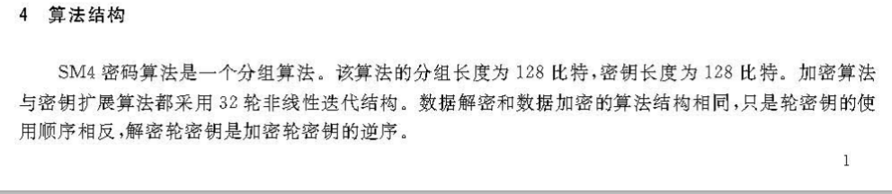
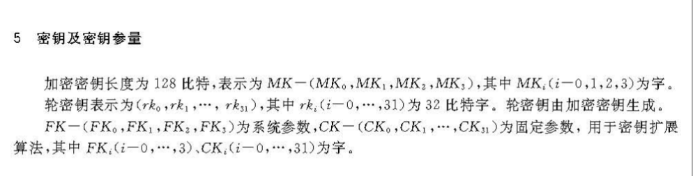
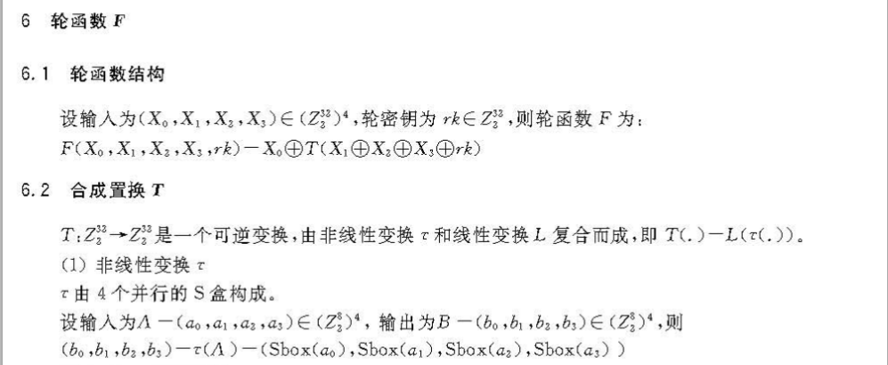
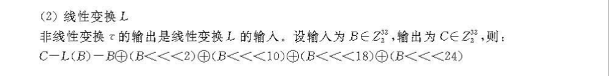
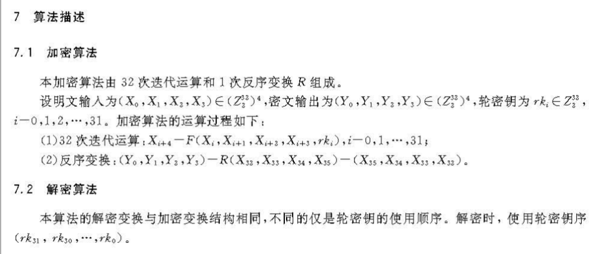
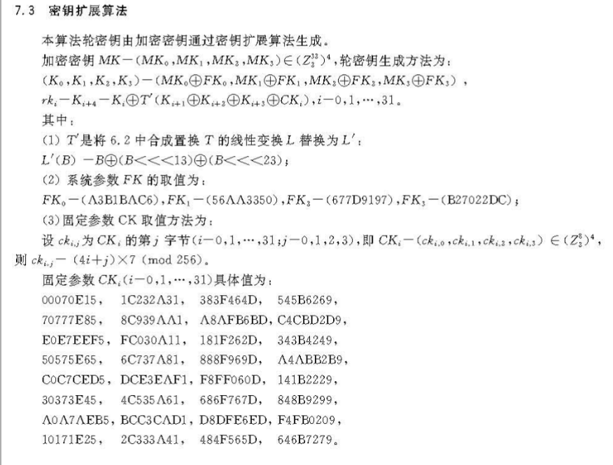
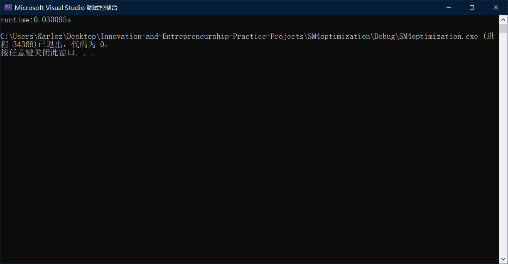
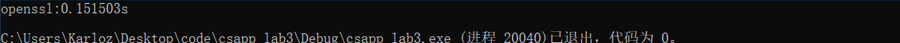

### SM4优化

本项目不属于课程中明确要求的项目，但有极大的相关性。由于指定的项目中有未能完成的项目，故自行选择了其它相关项目进行实现作为代替。

#### 代码说明

本项目中，使用了以下方法对SM4加密算法进行了优化。

- 函数调用改为宏定义
- 使用SIMD指令
- 算法优化

下面将详细介绍具体的优化方法。

首先说明sm4的算法结构：

##### 算法结构





正常情况下，一个分组为128位。为了最大利用硬件的并行性，我们使用avx512指令集，同时对512位，也即4个分组进行处理，理论上可以直接将速度提高4倍。

##### 轮函数





根据算法描述，首先应当实现T函数。为了减少代码量，方便调用，这里将T作为轮函数的代表，合并在一起实现。先计算$X_1 \oplus X_2\oplus X_3\oplus rk $作为函数的输入。

```c
FOUR_BYTES_XOR = _mm512_xor_si512(_mm512_xor_si512(x1, x2), _mm512_xor_si512(ROUNDKEY, x3));
```

T函数中，将32位分组分成4组，各1字节。可以看到，四组分别过S盒得到非线性变换的输出。

为了提升效率，可将S盒与后续的循环移位变换$L$ 合并，即

$L(S(x0),S(x1),S(x2),S(x3))=L(S(x0)<<24)⊕L(S(x1)<<16)⊕L(S(x2)<<8)⊕L(S(x3))$

也就是说，我们可以预先计算出8进32出的大表,合并非线性与线性两个组件。**这被称作查表优化。**预先计算结果见下表：

```c
const uint32_t SM4_Table[256] = 
{
    0x8ED55B5B, 0xD0924242, 0x4DEAA7A7, 0x06FDFBFB, 0xFCCF3333, 0x65E28787,
    0xC93DF4F4, 0x6BB5DEDE, 0x4E165858, 0x6EB4DADA, 0x44145050, 0xCAC10B0B,
    0x8828A0A0, 0x17F8EFEF, 0x9C2CB0B0, 0x11051414, 0x872BACAC, 0xFB669D9D,
    0xF2986A6A, 0xAE77D9D9, 0x822AA8A8, 0x46BCFAFA, 0x14041010, 0xCFC00F0F,
    0x02A8AAAA, 0x54451111, 0x5F134C4C, 0xBE269898, 0x6D482525, 0x9E841A1A,
    0x1E061818, 0xFD9B6666, 0xEC9E7272, 0x4A430909, 0x10514141, 0x24F7D3D3,
    0xD5934646, 0x53ECBFBF, 0xF89A6262, 0x927BE9E9, 0xFF33CCCC, 0x04555151,
    0x270B2C2C, 0x4F420D0D, 0x59EEB7B7, 0xF3CC3F3F, 0x1CAEB2B2, 0xEA638989,
    0x74E79393, 0x7FB1CECE, 0x6C1C7070, 0x0DABA6A6, 0xEDCA2727, 0x28082020,
    0x48EBA3A3, 0xC1975656, 0x80820202, 0xA3DC7F7F, 0xC4965252, 0x12F9EBEB,
    0xA174D5D5, 0xB38D3E3E, 0xC33FFCFC, 0x3EA49A9A, 0x5B461D1D, 0x1B071C1C,
    0x3BA59E9E, 0x0CFFF3F3, 0x3FF0CFCF, 0xBF72CDCD, 0x4B175C5C, 0x52B8EAEA,
    0x8F810E0E, 0x3D586565, 0xCC3CF0F0, 0x7D196464, 0x7EE59B9B, 0x91871616,
    0x734E3D3D, 0x08AAA2A2, 0xC869A1A1, 0xC76AADAD, 0x85830606, 0x7AB0CACA,
    0xB570C5C5, 0xF4659191, 0xB2D96B6B, 0xA7892E2E, 0x18FBE3E3, 0x47E8AFAF,
    0x330F3C3C, 0x674A2D2D, 0xB071C1C1, 0x0E575959, 0xE99F7676, 0xE135D4D4,
    0x661E7878, 0xB4249090, 0x360E3838, 0x265F7979, 0xEF628D8D, 0x38596161,
    0x95D24747, 0x2AA08A8A, 0xB1259494, 0xAA228888, 0x8C7DF1F1, 0xD73BECEC,
    0x05010404, 0xA5218484, 0x9879E1E1, 0x9B851E1E, 0x84D75353, 0x00000000,
    0x5E471919, 0x0B565D5D, 0xE39D7E7E, 0x9FD04F4F, 0xBB279C9C, 0x1A534949,
    0x7C4D3131, 0xEE36D8D8, 0x0A020808, 0x7BE49F9F, 0x20A28282, 0xD4C71313,
    0xE8CB2323, 0xE69C7A7A, 0x42E9ABAB, 0x43BDFEFE, 0xA2882A2A, 0x9AD14B4B,
    0x40410101, 0xDBC41F1F, 0xD838E0E0, 0x61B7D6D6, 0x2FA18E8E, 0x2BF4DFDF,
    0x3AF1CBCB, 0xF6CD3B3B, 0x1DFAE7E7, 0xE5608585, 0x41155454, 0x25A38686,
    0x60E38383, 0x16ACBABA, 0x295C7575, 0x34A69292, 0xF7996E6E, 0xE434D0D0,
    0x721A6868, 0x01545555, 0x19AFB6B6, 0xDF914E4E, 0xFA32C8C8, 0xF030C0C0,
    0x21F6D7D7, 0xBC8E3232, 0x75B3C6C6, 0x6FE08F8F, 0x691D7474, 0x2EF5DBDB,
    0x6AE18B8B, 0x962EB8B8, 0x8A800A0A, 0xFE679999, 0xE2C92B2B, 0xE0618181,
    0xC0C30303, 0x8D29A4A4, 0xAF238C8C, 0x07A9AEAE, 0x390D3434, 0x1F524D4D,
    0x764F3939, 0xD36EBDBD, 0x81D65757, 0xB7D86F6F, 0xEB37DCDC, 0x51441515,
    0xA6DD7B7B, 0x09FEF7F7, 0xB68C3A3A, 0x932FBCBC, 0x0F030C0C, 0x03FCFFFF,
    0xC26BA9A9, 0xBA73C9C9, 0xD96CB5B5, 0xDC6DB1B1, 0x375A6D6D, 0x15504545,
    0xB98F3636, 0x771B6C6C, 0x13ADBEBE, 0xDA904A4A, 0x57B9EEEE, 0xA9DE7777,
    0x4CBEF2F2, 0x837EFDFD, 0x55114444, 0xBDDA6767, 0x2C5D7171, 0x45400505,
    0x631F7C7C, 0x50104040, 0x325B6969, 0xB8DB6363, 0x220A2828, 0xC5C20707,
    0xF531C4C4, 0xA88A2222, 0x31A79696, 0xF9CE3737, 0x977AEDED, 0x49BFF6F6,
    0x992DB4B4, 0xA475D1D1, 0x90D34343, 0x5A124848, 0x58BAE2E2, 0x71E69797,
    0x64B6D2D2, 0x70B2C2C2, 0xAD8B2626, 0xCD68A5A5, 0xCB955E5E, 0x624B2929,
    0x3C0C3030, 0xCE945A5A, 0xAB76DDDD, 0x867FF9F9, 0xF1649595, 0x5DBBE6E6,
    0x35F2C7C7, 0x2D092424, 0xD1C61717, 0xD66FB9B9, 0xDEC51B1B, 0x94861212,
    0x78186060, 0x30F3C3C3, 0x897CF5F5, 0x5CEFB3B3, 0xD23AE8E8, 0xACDF7373,
    0x794C3535, 0xA0208080, 0x9D78E5E5, 0x56EDBBBB, 0x235E7D7D, 0xC63EF8F8,
    0x8BD45F5F, 0xE7C82F2F, 0xDD39E4E4, 0x68492121 };
```

在512位寄存器中，可以同时处理4个128位分组，因此对于每32位进行一次查表即可。这需要进行一系列的移位和位运算来提取出每个分组。

最终函数如下：

```c
#define T(OUTPUT, x0, x1, x2, x3, ROUNDKEY, temp1, temp2, temp3, temp4, SM4_TABLE, FOUR_BYTES_XOR)      \
    FOUR_BYTES_XOR = _mm512_xor_si512(_mm512_xor_si512(x1, x2), _mm512_xor_si512(ROUNDKEY, x3));        \
    LOW_8BITS = _mm512_set1_epi32(0xFF);     \
    temp1 = _mm512_srli_epi32(FOUR_BYTES_XOR, 24);    \
    temp2 = _mm512_srli_epi32(FOUR_BYTES_XOR, 16);    \
    temp1 = _mm512_and_si512(temp1, LOW_8BITS);       \
    temp2 = _mm512_and_si512(temp2, LOW_8BITS);        \
    temp1 = _mm512_i32gather_epi32(temp1, (int*)SM4_TABLE, 4);    \
    temp2 = _mm512_i32gather_epi32(temp2, (int*)SM4_TABLE, 4);    \
    LEFT_SHIFT(temp3, temp2, 24, temp4);             \
    temp2 = _mm512_srli_epi32(FOUR_BYTES_XOR, 8);    \
    temp1 = _mm512_xor_si512(temp1,temp3);          \
    temp2 = _mm512_and_si512(temp2, LOW_8BITS);        \
    temp2 = _mm512_i32gather_epi32(temp2, (int*)SM4_TABLE, 4);    \
    LEFT_SHIFT(temp3, temp2, 16, temp4);             \
    temp2 = _mm512_and_si512(FOUR_BYTES_XOR, LOW_8BITS);    \
    temp1 = _mm512_xor_si512(temp1,temp3);          \
    temp2 = _mm512_i32gather_epi32(temp2, (int*)SM4_TABLE, 4);       \
    LEFT_SHIFT(OUTPUT, temp2, 8, temp4);             \
    temp1 = _mm512_xor_si512(temp1,x0);          \
    OUTPUT = _mm512_xor_si512(temp1, OUTPUT);      \
    x0 = x1; x1 = x2; x2 = x3; x3 = OUTPUT;\
```

最后计算$X_0\oplus T(X_1 \oplus X_2\oplus X_3\oplus rk) $作为输出结果。

##### 过程描述



实现了轮函数后面的工作就比较简单。每次调入4个明文分组进入SIMD寄存器，迭代执行轮函数即可。

```c
    INIT_PLAINTEXT(x0, x1, x2, x3, plaintext, NullTemp0);
    for (int i = 0; i < 32; i++) 
    {
        m512RoundKey = _mm512_set1_epi32(RoundKey[i]);
        T(NullTemp0, x0, x1, x2, x3, m512RoundKey, NullTemp1, NullTemp2, NullTemp3, NullTemp4, SM4_Table, FOUR_BYTES_XOR);
    }
```

------



由于算法本身消耗的主要集中在加解密部分，而密钥扩展进行的运算量相对较少，因此没有对其进行优化，只进行了普通的实现。

```c
inline void InitRoundKey(uint32_t* round_key, uint32_t* key) 
{
    uint32_t i, temp1, temp2;
    uint32_t temp_X[36];
    uint32_t fk[4] = { 0xA3B1BAC6, 0x56AA3350, 0x677D9197, 0xB27022DC };
    FOR(i, 0, 4)temp_X[i] = key[i] ^ fk[i];

    for (i = 0; i < 32; ++i) {
        temp2 = (ck[i] ^ temp_X[i + 1]) ^ (temp_X[i + 2] ^ temp_X[i + 3]);
        temp1 = (Sbox[temp2 & 0xFF] ^ (Sbox[(temp2 >> 8) & 0xFF] << 8)) ^ ((Sbox[(temp2 >> 16) & 0xFF] << 16) ^ (Sbox[(temp2 >> 24) & 0xFF] << 24));
        temp_X[i + 4] = (temp_X[i] ^ ROTL(temp1, 23)) ^ (ROTL(temp1, 13) ^ temp1);
        round_key[i] = temp_X[i + 4];
    }
}
```

------

最后对于优化效果进行测试。

随机生成$2^{22}B=4MB$的明文数据进行加密，输出执行的总时间。

#### 运行结果

最终结果见下图：



可见，对于4MB的数据进行加密仅使用了0.03s。吞吐量达到了133MB/s。

对比于成熟的openssl库函数：



可见速度提高了约5倍，优化效果极佳。