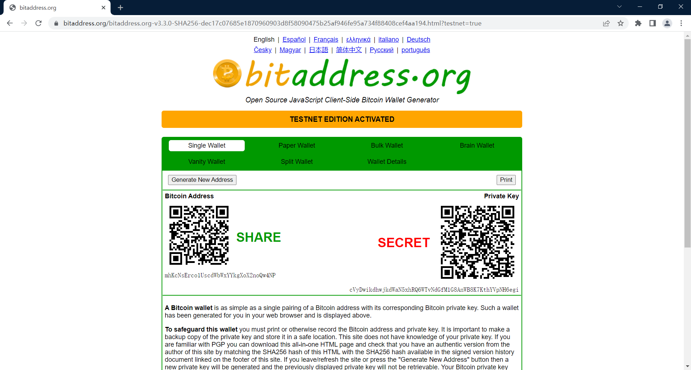
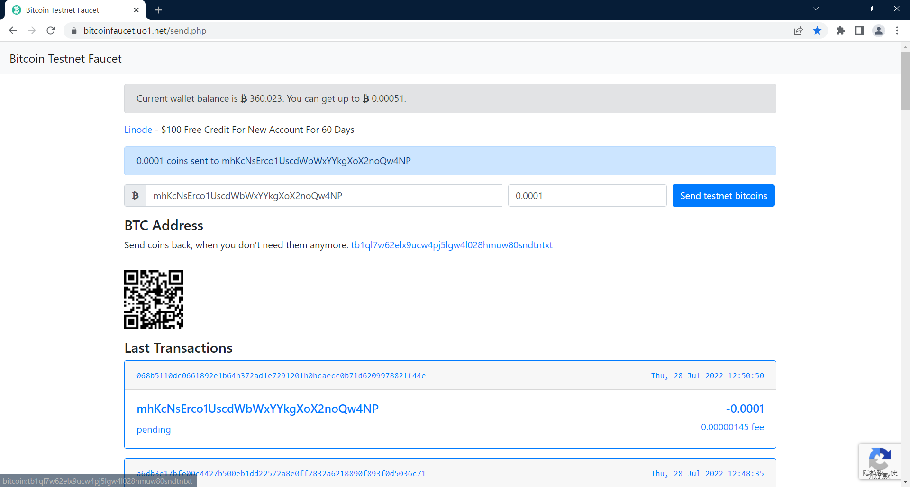
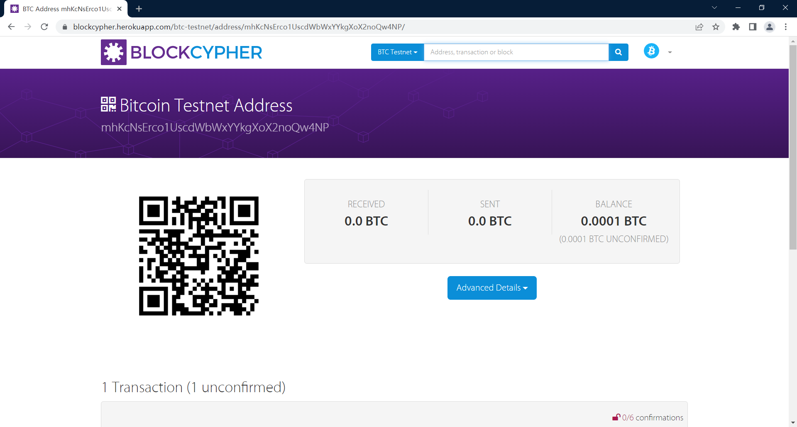
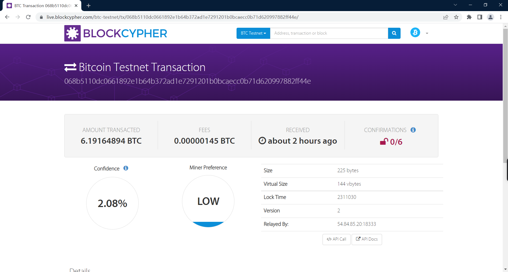
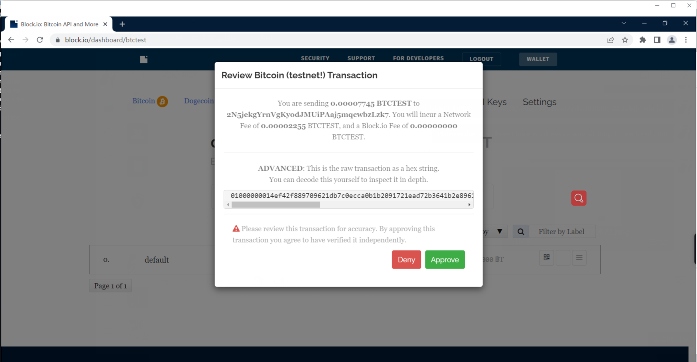
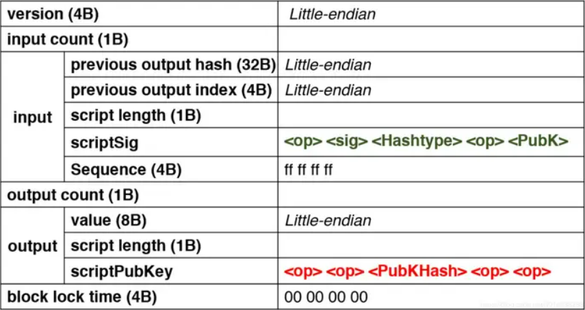
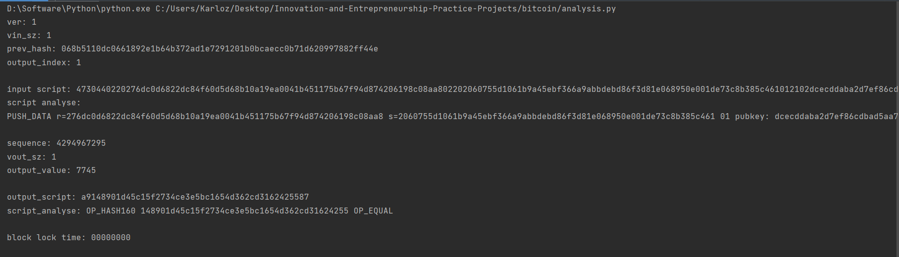

## Project: send a tx on Bitcoin testnet, and parse the tx data down to every bit, better write script yourself

### 项目说明

本项目实现的工作如下：

- 在bitcoin testnet上创建钱包。
- 申请一定数量的bitcoin并自己在测试网上提交一笔交易。
- 编写脚本对提取的交易的原始数据进行解析。

并最终对于以上工作编辑了详细的报告。

下面将分别介绍几个重要的部分。

**注：下面涉及到的网站都需要通过代理访问，如果无法访问请使用VPN代理。**

#### 发布交易

首先介绍如何申请比特币并在testnet上发布交易。

第一，我们需要一个比特币地址，用于申请测试用币。

进入网站www.bitaddress.org。



该网站可以通过键盘输入随机字符或者读取鼠标运动轨迹生成一个地址及其对应的私钥。当进度达到100%时可以得到结果，如同上图。

其中，左边的字符串是创建的地址，右边是私钥。真实的情况下私钥应当秘密保存，绝不可泄露。由于本项目只是进行测试，故不做保密。有了这个地址后，我们就可以在网络上申请一些测试用的比特币到这个地址中。如果我们需要使用这些比特币，则应使用对应的私钥提取出来。

------

下面介绍一个发放测试用币的网站https://bitcoinfaucet.uo1.net。



在此，一个IP可以申请到至多0.00072个可在testnet中使用的比特币。这里我们输入刚刚生成的地址，点击申请获得0.0001个比特币。可以看到下面马上出现了一条交易信息，恰好对应了我们的地址。到此为止，我们已经成功地取得了一些可用的比特币。

------

进入https://live.blockcypher.com/btc-testnet 可以查看testnet上进行的所有交易。在搜索框中输入我们的地址可以看到下面的信息：



点击查看交易详情



进一步地，通过API Call可以查看详细的交易JSON数据，提取出这些数据。

```json
{
  "block_height": -1,
  "block_index": -1,
  "hash": "068b5110dc0661892e1b64b372ad1e7291201b0bcaecc0b71d620997882ff44e",
  "hex": "020000000001010e414fb48a5039d9dfdc27a67a25716ae6907ce3902d8598bf97d6143c65ff150000000000feffffff02ce8de7240000000016001431327d6496b79d6e43b5c996171244e0a63145ee10270000000000001976a91413cb0cd3484ead63a6753ed255a120f39771224f88ac0247304402202d31d21e3dbfc66cce19d4d7e517cc23ca0d045d543e66b67e3518652c80506c02200d9977febffea9c39404d4d41dd9f6caca086957839a8131f806e1347baa1e2101210223b29c07fcb671c4fbdaf106c872149d54c3f61632728ce1c4ea6fe1ab254c3b76432300",
  "addresses": [
    "mhKcNsErco1UscdWbWxYYkgXoX2noQw4NP",
    "tb1qqdccjzph45vhm5gahxqmhahzzvspl9l9gmz2pc",
    "tb1qxye86eykk7wkusa4extpwyjyuznrz30wghy3g9"
  ],
  "total": 619164894,
  "fees": 145,
  "size": 225,
  "vsize": 144,
  "preference": "low",
  "relayed_by": "54.84.85.20:18333",
  "received": "2022-07-28T12:50:54.7Z",
  "ver": 2,
  "lock_time": 2311030,
  "double_spend": false,
  "vin_sz": 1,
  "vout_sz": 2,
  "confirmations": 0,
  "inputs": [
    {
      "prev_hash": "15ff653c14d697bf98852d90e37c90e66a71257aa627dcdfd939508ab44f410e",
      "output_index": 0,
      "output_value": 619165039,
      "sequence": 4294967294,
      "addresses": [
        "tb1qqdccjzph45vhm5gahxqmhahzzvspl9l9gmz2pc"
      ],
      "script_type": "pay-to-witness-pubkey-hash",
      "age": 0,
      "witness": [
        "304402202d31d21e3dbfc66cce19d4d7e517cc23ca0d045d543e66b67e3518652c80506c02200d9977febffea9c39404d4d41dd9f6caca086957839a8131f806e1347baa1e2101",
        "0223b29c07fcb671c4fbdaf106c872149d54c3f61632728ce1c4ea6fe1ab254c3b"
      ]
    }
  ],
  "outputs": [
    {
      "value": 619154894,
      "script": "001431327d6496b79d6e43b5c996171244e0a63145ee",
      "addresses": [
        "tb1qxye86eykk7wkusa4extpwyjyuznrz30wghy3g9"
      ],
      "script_type": "pay-to-witness-pubkey-hash"
    },
    {
      "value": 10000,
      "script": "76a91413cb0cd3484ead63a6753ed255a120f39771224f88ac",
      "addresses": [
        "mhKcNsErco1UscdWbWxYYkgXoX2noQw4NP"
      ],
      "script_type": "pay-to-pubkey-hash"
    }
  ]
}
```

------

下面我们将使用获得的比特币尝试进行交易。

为了实现交易，首先需要拥有一个钱包。

可以在https://block.io 中创建一个testnet账户。当账户创建成功时，其会自动给与一个地址。此时我们可以使用前面记录的私钥将申请的0.0001个比特币提取出来到钱包中。这样事实上就又产生了一笔交易。



我们就选择这一条交易进行解析。

------

为了解析数据，需要了解区块链交易的数据格式。

详情如下：



下面是我们提取出的交易信息。其中，hex字段就是区块链中实际传输的数据，也就是我们解析的目标。

```json
{
  "block_height": -1,
  "block_index": -1,
  "hash": "27fb140935aaea927f38738841a37ff0848686ca251b9297841c0043fa123c9e",
  "hex": "01000000014ef42f889709621db7c0ecca0b1b2091721ead72b3641b2e896106dc10518b06010000006a4730440220276dc0d6822dc84f60d5d68b10a19ea0041b451175b67f94d874206198c08aa802202060755d1061b9a45ebf366a9abbdebd86f3d81e068950e001de73c8b385c461012102dcecddaba2d7ef86cdbad5aa79aecd00593801d99deff79ca796b0dcd136908cffffffff01411e00000000000017a9148901d45c15f2734ce3e5bc1654d362cd316242558700000000",
  "addresses": [
    "2N5jekgYrnVgKyodJMUiPAaj5mqcwbzLzk7",
    "mhKcNsErco1UscdWbWxYYkgXoX2noQw4NP"
  ],
  "total": 7745,
  "fees": 2255,
  "size": 189,
  "vsize": 189,
  "preference": "low",
  "relayed_by": "54.84.85.20:18333",
  "received": "2022-07-28T14:37:24.727Z",
  "ver": 1,
  "double_spend": false,
  "vin_sz": 1,
  "vout_sz": 1,
  "confirmations": 0,
  "inputs": [
    {
      "prev_hash": "068b5110dc0661892e1b64b372ad1e7291201b0bcaecc0b71d620997882ff44e",
      "output_index": 1,
      "script": "4730440220276dc0d6822dc84f60d5d68b10a19ea0041b451175b67f94d874206198c08aa802202060755d1061b9a45ebf366a9abbdebd86f3d81e068950e001de73c8b385c461012102dcecddaba2d7ef86cdbad5aa79aecd00593801d99deff79ca796b0dcd136908c",
      "output_value": 10000,
      "sequence": 4294967295,
      "addresses": [
        "mhKcNsErco1UscdWbWxYYkgXoX2noQw4NP"
      ],
      "script_type": "pay-to-pubkey-hash",
      "age": 0
    }
  ],
  "outputs": [
    {
      "value": 7745,
      "script": "a9148901d45c15f2734ce3e5bc1654d362cd3162425587",
      "addresses": [
        "2N5jekgYrnVgKyodJMUiPAaj5mqcwbzLzk7"
      ],
      "script_type": "pay-to-script-hash"
    }
  ]
}
```

#### 交易解析

下面编写程序进行解析。

注意到，前面的数据格式图中提到了小端存储的特性。因此为了获得正确的数据，应当对于小端存储的字段进行反转。事实上就是将16进制串按字节逆序过来即可。

```python
def little_endian(s):
    invs = ''
    l = len(s)
    for i in range(l // 2):
        invs += s[l - i * 2 - 2:l - i * 2]
    return invs
```

然后根据固定的长度提取出交易的各个字段。

```python
version = little_endian(raw_data[:8])
# input
input_cnt = raw_data[8:10]
previous_output_hash = little_endian(raw_data[10:74])
previous_output_index = little_endian(raw_data[74:82])
in_script_len = raw_data[82:84]
scriptSig = raw_data[84:84 + int(in_script_len, 16) * 2]
sequence = raw_data[84 + int(in_script_len, 16) * 2:84 + int(in_script_len, 16) * 2 + 8]

# output
output_cnt = raw_data[idx:idx + 2]
output_value = little_endian(raw_data[idx + 2:idx + 18])
out_script_len = raw_data[idx + 18:idx + 20]
scriptPubKey = raw_data[idx + 20:idx + 20 + int(out_script_len, 16) * 2]
```

打印提取的数据查看情况

```python
ver: 1
vin_sz: 1
prev_hash: 068b5110dc0661892e1b64b372ad1e7291201b0bcaecc0b71d620997882ff44e
output_index: 1
input script: 4730440220276dc0d6822dc84f60d5d68b10a19ea0041b451175b67f94d874206198c08aa802202060755d1061b9a45ebf366a9abbdebd86f3d81e068950e001de73c8b385c461012102dcecddaba2d7ef86cdbad5aa79aecd00593801d99deff79ca796b0dcd136908c
sequence: 4294967295
vout_sz: 1
output_value: 7745
output_script: a9148901d45c15f2734ce3e5bc1654d362cd3162425587
block lock time: 00000000
```

**与API结合解析后的数据对应字段进行比较，发现完全一致。说明解析正确。**

------

下面将分析各个字段的含义。

version：版本号，4B，通常为1。

input count：交易输入个数，1B。

previous_output_hash：上一条交易的hash值，32B。对比可以发现这里提取出的hash值恰好是上一笔申请获得测试币的交易的hash值。

previous_output_index：用于标识一笔交易的索引，4B。

script_length：script的长度，用于确定变长数据的边界，1B。

scriptSig：input的解锁脚本。不同的类型解析方式不同。

output count：输出的个数，1B。

output_value：输出的比特币数量，表示$10^{-8}$个比特币的倍数。

scriptPubKey：加锁脚本，不同类型解析方式不同。

------

到此为止，我们实现了发布交易、从原始数据中解析出各个字段的值、并且解释了其含义。

但是仍然有一个谜题没有解决，即脚本的数据代表什么含义。

因此进一步地，我们将对输入输出脚本的真实含义进行解析。要分析脚本，首先需要明确脚本的种类。根据API解析的结果看出，输入输出脚本的种类分别为pay-to-pubkey-hash和pay-to-script-hash。

先来看输入。

通过查找资料得到，pay-to-pubkey-hash类型的输入脚本格式如下：

> PUSHDATA(< Cafe Signature >) < Cafe Public Key >

脚本的第一个字节是一个指令，表示将后续数据压入栈中。其封装格式为：

> 如果0 < data.length < 76(0x4C)，则结果为：1个字节data.length + data数据
>
> 如果76(0x4C) <= data.length < 2^8，则结果为：0x4C + 1个字节data.length + data数据
>
> 如果2^8 <= data.length < 2^16，则结果为：0x4D + 2个字节data.length + data数据
>
> 如果2^16 <= data.length < 2^32，则结果为：0x4E + 4个字节data.length + data数据

这里不用完全理解，暂时不影响后续分析。

指令后紧跟的是签名值，其格式为DER(r,s) + SIGHASH。r和s是均为32B的签名值，SIGHASH是一个表示hash类型的1字节数据。DER是ASN1数据格式中的一种，封装规则为：开头是固定值0x30，后面一个字节为后续数据长度，0x0220或者0x022100后面就是签名值r和s。

签名后面是公钥，有两种表示方式，分别是非压缩格式和压缩格式。

压缩格式就是数据中只有公钥的X，没有Y。压缩公钥以0x21开头，0x02或0x03代表Y值在X轴的上方还是下方，后面是X点的数据(32 bytes)。非压缩格式的数据，开头是0x41,0x04，后面紧跟着X点的数据(32 bytes)和Y点的数据(32 bytes)。

以上就是完整的脚本规则。

------

对于输出脚本，其类型为pay-to-script-hash。这种类型比较简单，格式通常为：OP_HASH160 PUSHDATA(<20-byte hash of Redeem Script>) OP_EQUAL。

其中，OP_HASH160和OP_EQUAL都是用一个字节的操作码，分别是0xa9、0x87。观察我们提取出的脚本发现，恰好首尾的两个字节就是这两个指令。这样中间的数据就是hash值。

------

根据以上规则，解析脚本中各个字段的值及其含义。

```python
# input
sig = 'r='+scriptSig[10:10 + 64] + ' s=' + scriptSig[74 + 4:74 + 4 + 64]
Hashtype = scriptSig[74 + 4 + 64:74 + 4 + 64 + 2]
pubkey = scriptSig[74 + 4 + 64 + 2:]
print('PUSH_DATA',sig, Hashtype, 'pubkey:', pubkey[4:])

# output
OP = {'87': 'OP_EQUAL', '88': 'OP_EUQALVERIFY', 'a9': 'OP_HASH160'}
print('script_analyse:', OP[scriptPubKey[:2]], scriptPubKey[2:-2], OP[scriptPubKey[-2:]])
```

得到结果：

```python
script analyse:
PUSH_DATA r=276dc0d6822dc84f60d5d68b10a19ea0041b451175b67f94d874206198c08aa8 s=2060755d1061b9a45ebf366a9abbdebd86f3d81e068950e001de73c8b385c461 01 pubkey: dcecddaba2d7ef86cdbad5aa79aecd00593801d99deff79ca796b0dcd136908c

script_analyse: 
OP_HASH160 148901d45c15f2734ce3e5bc1654d362cd31624255 OP_EQUAL
```

至此，完成了所有分析工作。

#### 运行结果

最终输出所有分析结果。



#### 运行指导

在本项目文件夹下执行analysis.py。
