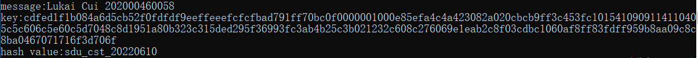

# Meow hash

**Project: Find a key with hash value “sdu_cst_20220610” under a message composed of your name followed by your student ID. For example, “San Zhan 202000460001”.**

------

##### 实现思路

根据计算hash的过程，将整个函数以及其中的组件逆向转化成求解key的函数。

逆向包括逆运算和逆序两个部分。

首先，对于计算顺序，还原的过程应与原函数相反，确保数据的时序性。

然后对于各种独立的运算，应当修改为逆运算。比如：加法改为减法，解密改为加密。由于异或操作自身可逆，不需要改动。

原函数如下，分析其过程。

在最开始，可以明确rax和rcx分别保存了输入的信息和key。最开始的时候将key的每16字节（128bit）存放在128位simd寄存器中，参与了一系列运算。

```c++
MeowHash(void *Seed128Init, meow_umm Len, void *SourceInit)
{
    meow_u128 xmm0, xmm1, xmm2, xmm3, xmm4, xmm5, xmm6, xmm7; // NOTE(casey): xmm0-xmm7 are the hash accumulation lanes
    meow_u128 xmm8, xmm9, xmm10, xmm11, xmm12, xmm13, xmm14, xmm15; // NOTE(casey): xmm8-xmm15 hold values to be appended (residual, length)
    
    meow_u8 *rax = (meow_u8 *)SourceInit;
    meow_u8 *rcx = (meow_u8 *)Seed128Init;
    
    //
	// NOTE(casey): Seed the eight hash registers
    //
    
    movdqu(xmm0, rcx + 0x00);
    movdqu(xmm1, rcx + 0x10);
    movdqu(xmm2, rcx + 0x20);
    movdqu(xmm3, rcx + 0x30);
    
    movdqu(xmm4, rcx + 0x40);
    movdqu(xmm5, rcx + 0x50);
    movdqu(xmm6, rcx + 0x60);
    movdqu(xmm7, rcx + 0x70);
    
    MEOW_DUMP_STATE("Seed", xmm0, xmm1, xmm2, xmm3, xmm4, xmm5, xmm6, xmm7, 0);
    
    //
    // NOTE(casey): Hash all full 256-byte blocks
    //
    
    meow_umm BlockCount = (Len >> 8);
    if(BlockCount > MEOW_PREFETCH_LIMIT)
    {
        // NOTE(casey): For large input, modern Intel x64's can't hit full speed without prefetching, so we use this loop
        while(BlockCount--)
        {
            prefetcht0(rax + MEOW_PREFETCH + 0x00);
            prefetcht0(rax + MEOW_PREFETCH + 0x40);
            prefetcht0(rax + MEOW_PREFETCH + 0x80);
            prefetcht0(rax + MEOW_PREFETCH + 0xc0);
            
            MEOW_MIX(xmm0,xmm4,xmm6,xmm1,xmm2, rax + 0x00);
            MEOW_MIX(xmm1,xmm5,xmm7,xmm2,xmm3, rax + 0x20);
            MEOW_MIX(xmm2,xmm6,xmm0,xmm3,xmm4, rax + 0x40);
            MEOW_MIX(xmm3,xmm7,xmm1,xmm4,xmm5, rax + 0x60);
            MEOW_MIX(xmm4,xmm0,xmm2,xmm5,xmm6, rax + 0x80);
            MEOW_MIX(xmm5,xmm1,xmm3,xmm6,xmm7, rax + 0xa0);
            MEOW_MIX(xmm6,xmm2,xmm4,xmm7,xmm0, rax + 0xc0);
            MEOW_MIX(xmm7,xmm3,xmm5,xmm0,xmm1, rax + 0xe0);
            
            rax += 0x100;
        }
    }
    else
    {
        // NOTE(casey): For small input, modern Intel x64's can't hit full speed _with_ prefetching (because of port pressure), so we use this loop.
        while(BlockCount--)
        {
            MEOW_MIX(xmm0,xmm4,xmm6,xmm1,xmm2, rax + 0x00);
            MEOW_MIX(xmm1,xmm5,xmm7,xmm2,xmm3, rax + 0x20);
            MEOW_MIX(xmm2,xmm6,xmm0,xmm3,xmm4, rax + 0x40);
            MEOW_MIX(xmm3,xmm7,xmm1,xmm4,xmm5, rax + 0x60);
            MEOW_MIX(xmm4,xmm0,xmm2,xmm5,xmm6, rax + 0x80);
            MEOW_MIX(xmm5,xmm1,xmm3,xmm6,xmm7, rax + 0xa0);
            MEOW_MIX(xmm6,xmm2,xmm4,xmm7,xmm0, rax + 0xc0);
            MEOW_MIX(xmm7,xmm3,xmm5,xmm0,xmm1, rax + 0xe0);
            
            rax += 0x100;
        }
    }
    
    MEOW_DUMP_STATE("PostBlocks", xmm0, xmm1, xmm2, xmm3, xmm4, xmm5, xmm6, xmm7, 0);
    
    //
    // NOTE(casey): Load any less-than-32-byte residual
    //
    
    pxor_clear(xmm9, xmm9);
    pxor_clear(xmm11, xmm11);
    
    //
    // TODO(casey): I need to put more thought into how the end-of-buffer stuff is actually working out here,
    // because I _think_ it may be possible to remove the first branch (on Len8) and let the mask zero out the
    // result, but it would take a little thought to make sure it couldn't read off the end of the buffer due
    // to the & 0xf on the align computation.
    //
    
    // NOTE(casey): First, we have to load the part that is _not_ 16-byte aligned
    meow_u8 *Last = (meow_u8 *)SourceInit + (Len & ~0xf);
    int unsigned Len8 = (Len & 0xf);
    if(Len8)
    {
        // NOTE(casey): Load the mask early
        movdqu(xmm8, &MeowMaskLen[0x10 - Len8]);
        
        meow_u8 *LastOk = (meow_u8*)((((meow_umm)(((meow_u8 *)SourceInit)+Len - 1)) | (MEOW_PAGESIZE - 1)) - 16);
        int Align = (Last > LastOk) ? ((int)(meow_umm)Last) & 0xf : 0;
        movdqu(xmm10, &MeowShiftAdjust[Align]);
        movdqu(xmm9, Last - Align);
        pshufb(xmm9, xmm10);
        
        // NOTE(jeffr): and off the extra bytes
        pand(xmm9, xmm8);
    }
    
    // NOTE(casey): Next, we have to load the part that _is_ 16-byte aligned
    if(Len & 0x10)
    {
        xmm11 = xmm9;
        movdqu(xmm9, Last - 0x10);
    }
    
    //
    // NOTE(casey): Construct the residual and length injests
    //
    
    xmm8 = xmm9;
    xmm10 = xmm9;
    palignr(xmm8, xmm11, 15);
    palignr(xmm10, xmm11, 1);
    
    // NOTE(casey): We have room for a 128-bit nonce and a 64-bit none here, but
    // the decision was made to leave them zero'd so as not to confuse people
    // about hwo to use them or what security implications they had.
    pxor_clear(xmm12, xmm12);
    pxor_clear(xmm13, xmm13);
    pxor_clear(xmm14, xmm14);
    movq(xmm15, Len);
    palignr(xmm12, xmm15, 15);
    palignr(xmm14, xmm15, 1);
    
    MEOW_DUMP_STATE("Residuals", xmm8, xmm9, xmm10, xmm11, xmm12, xmm13, xmm14, xmm15, 0);
    
    // NOTE(casey): To maintain the mix-down pattern, we always Meow Mix the less-than-32-byte residual, even if it was empty
    MEOW_MIX_REG(xmm0, xmm4, xmm6, xmm1, xmm2,  xmm8, xmm9, xmm10, xmm11);
    
    // NOTE(casey): Append the length, to avoid problems with our 32-byte padding
    MEOW_MIX_REG(xmm1, xmm5, xmm7, xmm2, xmm3,  xmm12, xmm13, xmm14, xmm15);
    
    MEOW_DUMP_STATE("PostAppend", xmm0, xmm1, xmm2, xmm3, xmm4, xmm5, xmm6, xmm7, 0);
    
    //
    // NOTE(casey): Hash all full 32-byte blocks
    //
    int unsigned LaneCount = (Len >> 5) & 0x7;
    if(LaneCount == 0) goto MixDown; MEOW_MIX(xmm2,xmm6,xmm0,xmm3,xmm4, rax + 0x00); --LaneCount;
    if(LaneCount == 0) goto MixDown; MEOW_MIX(xmm3,xmm7,xmm1,xmm4,xmm5, rax + 0x20); --LaneCount;
    if(LaneCount == 0) goto MixDown; MEOW_MIX(xmm4,xmm0,xmm2,xmm5,xmm6, rax + 0x40); --LaneCount;
    if(LaneCount == 0) goto MixDown; MEOW_MIX(xmm5,xmm1,xmm3,xmm6,xmm7, rax + 0x60); --LaneCount;
    if(LaneCount == 0) goto MixDown; MEOW_MIX(xmm6,xmm2,xmm4,xmm7,xmm0, rax + 0x80); --LaneCount;
    if(LaneCount == 0) goto MixDown; MEOW_MIX(xmm7,xmm3,xmm5,xmm0,xmm1, rax + 0xa0); --LaneCount;
    if(LaneCount == 0) goto MixDown; MEOW_MIX(xmm0,xmm4,xmm6,xmm1,xmm2, rax + 0xc0); --LaneCount;
    
    //
    // NOTE(casey): Mix the eight lanes down to one 128-bit hash
    //
    
    MixDown:
    
    MEOW_DUMP_STATE("PostLanes", xmm0, xmm1, xmm2, xmm3, xmm4, xmm5, xmm6, xmm7, 0);
    
    MEOW_SHUFFLE(xmm0, xmm1, xmm2, xmm4, xmm5, xmm6);
    MEOW_SHUFFLE(xmm1, xmm2, xmm3, xmm5, xmm6, xmm7);
    MEOW_SHUFFLE(xmm2, xmm3, xmm4, xmm6, xmm7, xmm0);
    MEOW_SHUFFLE(xmm3, xmm4, xmm5, xmm7, xmm0, xmm1);
    MEOW_SHUFFLE(xmm4, xmm5, xmm6, xmm0, xmm1, xmm2);
    MEOW_SHUFFLE(xmm5, xmm6, xmm7, xmm1, xmm2, xmm3);
    MEOW_SHUFFLE(xmm6, xmm7, xmm0, xmm2, xmm3, xmm4);
    MEOW_SHUFFLE(xmm7, xmm0, xmm1, xmm3, xmm4, xmm5);
    MEOW_SHUFFLE(xmm0, xmm1, xmm2, xmm4, xmm5, xmm6);
    MEOW_SHUFFLE(xmm1, xmm2, xmm3, xmm5, xmm6, xmm7);
    MEOW_SHUFFLE(xmm2, xmm3, xmm4, xmm6, xmm7, xmm0);
    MEOW_SHUFFLE(xmm3, xmm4, xmm5, xmm7, xmm0, xmm1);
    
    MEOW_DUMP_STATE("PostMix", xmm0, xmm1, xmm2, xmm3, xmm4, xmm5, xmm6, xmm7, 0);
    
    paddq(xmm0, xmm2);
    paddq(xmm1, xmm3);
    paddq(xmm4, xmm6);
    paddq(xmm5, xmm7);
    pxor(xmm0, xmm1);
    pxor(xmm4, xmm5);
    paddq(xmm0, xmm4);
    
    MEOW_DUMP_STATE("PostFold", xmm0, xmm1, xmm2, xmm3, xmm4, xmm5, xmm6, xmm7, 0);
    
    return(xmm0);
}
```

函数的最后，发现返回了xmm0。说明最终的hash值保存在xmm0中。

那么当逆向还原的时候，xmm0就应当被赋值为已知的hash值。从最后一行逆向往上看，可以看到，不同组数据进行了一些运算，而此时我们只知道xmm0的值，而不能确定其它寄存器中的状态。

事实上，到了最后的运算，xmm0~xmm15中的数据都是完全由密钥key和输入数据决定的。输入数据已知，不会改变。这说明：一种key可以唯一决定一种状态。反之，由于整个运算过程都是可逆的，任意给出一种状态，一定可以确定一个密钥。

因此，这里可以随意设置寄存器状态，赋予任意的值，最后得到一种密钥。方便起见，全部置为0。

一路反着还原回去，最终得到的xmm0~xmm7中保存的就是key的值。

逆向函数如下：

```c++
static void MeowHash_re(void* hash, meow_umm Len, void* SourceInit, unsigned char* rcx)
{
    meow_u128 xmm0, xmm1, xmm2, xmm3, xmm4, xmm5, xmm6, xmm7; // NOTE(casey): xmm0-xmm7 are the hash accumulation lanes
    meow_u128 xmm8, xmm9, xmm10, xmm11, xmm12, xmm13, xmm14, xmm15; // NOTE(casey): xmm8-xmm15 hold values to be appended (residual, length)

    meow_u8* rax = (meow_u8*)SourceInit + (Len >> 8) * 32;

    movdqu(xmm0, hash);

    pxor_clear(xmm1, xmm1);
    pxor_clear(xmm2, xmm2);
    pxor_clear(xmm3, xmm3);
    pxor_clear(xmm4, xmm4);
    pxor_clear(xmm5, xmm5);
    pxor_clear(xmm6, xmm6);
    pxor_clear(xmm7, xmm7);


    psubq(xmm0, xmm4);
    pxor(xmm4, xmm5);
    pxor(xmm0, xmm1);
    psubq(xmm5, xmm7);
    psubq(xmm4, xmm6);
    psubq(xmm1, xmm3);
    psubq(xmm0, xmm2);


    MEOW_SHUFFLE_re(xmm3, xmm4, xmm5, xmm7, xmm0, xmm1);
    MEOW_SHUFFLE_re(xmm2, xmm3, xmm4, xmm6, xmm7, xmm0);
    MEOW_SHUFFLE_re(xmm1, xmm2, xmm3, xmm5, xmm6, xmm7);
    MEOW_SHUFFLE_re(xmm0, xmm1, xmm2, xmm4, xmm5, xmm6);
    MEOW_SHUFFLE_re(xmm7, xmm0, xmm1, xmm3, xmm4, xmm5);
    MEOW_SHUFFLE_re(xmm6, xmm7, xmm0, xmm2, xmm3, xmm4);
    MEOW_SHUFFLE_re(xmm5, xmm6, xmm7, xmm1, xmm2, xmm3);
    MEOW_SHUFFLE_re(xmm4, xmm5, xmm6, xmm0, xmm1, xmm2);
    MEOW_SHUFFLE_re(xmm3, xmm4, xmm5, xmm7, xmm0, xmm1);
    MEOW_SHUFFLE_re(xmm2, xmm3, xmm4, xmm6, xmm7, xmm0);
    MEOW_SHUFFLE_re(xmm1, xmm2, xmm3, xmm5, xmm6, xmm7);
    MEOW_SHUFFLE_re(xmm0, xmm1, xmm2, xmm4, xmm5, xmm6);


    int unsigned LaneCount = (Len >> 5) & 0x7;
    switch (LaneCount)
    {
        case 7:goto label7;
        case 6:goto label6;
        case 5:goto label5;
        case 4:goto label4;
        case 3:goto label3;
        case 2:goto label2;
        case 1:goto label1;
          
        default:
            goto label0;
    }

    label7:
    MEOW_MIX_re(xmm0, xmm4, xmm6, xmm1, xmm2, rax + 0xc0); 
    label6:
    MEOW_MIX_re(xmm7, xmm3, xmm5, xmm0, xmm1, rax + 0xa0); 
    label5:
    MEOW_MIX_re(xmm6, xmm2, xmm4, xmm7, xmm0, rax + 0x80); 
    label4:
    MEOW_MIX_re(xmm5, xmm1, xmm3, xmm6, xmm7, rax + 0x60); 
    label3:
    MEOW_MIX_re(xmm4, xmm0, xmm2, xmm5, xmm6, rax + 0x40); 
    label2:
    MEOW_MIX_re(xmm3, xmm7, xmm1, xmm4, xmm5, rax + 0x20); 
    label1:
    MEOW_MIX_re(xmm2, xmm6, xmm0, xmm3, xmm4, rax + 0x00); 


    label0:
    pxor_clear(xmm9, xmm9);
    pxor_clear(xmm11, xmm11);


    meow_u8* Last = (meow_u8*)SourceInit + (Len & ~0xf);
    int unsigned Len8 = (Len & 0xf);
    if (Len8)
    {
        // NOTE(casey): Load the mask early
        movdqu(xmm8, &MeowMaskLen[0x10 - Len8]);

        meow_u8* LastOk = (meow_u8*)((((meow_umm)(((meow_u8*)SourceInit) + Len - 1)) | (MEOW_PAGESIZE - 1)) - 16);
        int Align = (Last > LastOk) ? ((int)(meow_umm)Last) & 0xf : 0;
        movdqu(xmm10, &MeowShiftAdjust[Align]);
        movdqu(xmm9, Last - Align);
        pshufb(xmm9, xmm10);

        // NOTE(jeffr): and off the extra bytes
        pand(xmm9, xmm8);
    }

    // NOTE(casey): Next, we have to load the part that _is_ 16-byte aligned
    if (Len & 0x10)
    {
        xmm11 = xmm9;
        movdqu(xmm9, Last - 0x10);
    }

    xmm8 = xmm9;
    xmm10 = xmm9;
    palignr(xmm8, xmm11, 15);
    palignr(xmm10, xmm11, 1);


    pxor_clear(xmm12, xmm12);
    pxor_clear(xmm13, xmm13);
    pxor_clear(xmm14, xmm14);
    movq(xmm15, Len);
    palignr(xmm12, xmm15, 15);
    palignr(xmm14, xmm15, 1);


    MEOW_MIX_REG_re(xmm1, xmm5, xmm7, xmm2, xmm3, xmm12, xmm13, xmm14, xmm15);
    MEOW_MIX_REG_re(xmm0, xmm4, xmm6, xmm1, xmm2, xmm8, xmm9, xmm10, xmm11);


    meow_umm BlockCount = (Len >> 8);
    if (BlockCount > MEOW_PREFETCH_LIMIT)
    {
        // NOTE(casey): For large input, modern Intel x64's can't hit full speed without prefetching, so we use this loop
        while (BlockCount--)
        {
            prefetcht0(rax + MEOW_PREFETCH + 0x00);
            prefetcht0(rax + MEOW_PREFETCH + 0x40);
            prefetcht0(rax + MEOW_PREFETCH + 0x80);
            prefetcht0(rax + MEOW_PREFETCH + 0xc0);

            MEOW_MIX_re(xmm7, xmm3, xmm5, xmm0, xmm1, rax + 0xe0);
            MEOW_MIX_re(xmm6, xmm2, xmm4, xmm7, xmm0, rax + 0xc0);
            MEOW_MIX_re(xmm5, xmm1, xmm3, xmm6, xmm7, rax + 0xa0);
            MEOW_MIX_re(xmm4, xmm0, xmm2, xmm5, xmm6, rax + 0x80);
            MEOW_MIX_re(xmm3, xmm7, xmm1, xmm4, xmm5, rax + 0x60);
            MEOW_MIX_re(xmm2, xmm6, xmm0, xmm3, xmm4, rax + 0x40);
            MEOW_MIX_re(xmm1, xmm5, xmm7, xmm2, xmm3, rax + 0x20);
            MEOW_MIX_re(xmm0, xmm4, xmm6, xmm1, xmm2, rax + 0x00);

            rax -= 0x100;
        }
    }
    else
    {
        // NOTE(casey): For small input, modern Intel x64's can't hit full speed _with_ prefetching (because of port pressure), so we use this loop.
        while (BlockCount--)
        {
            MEOW_MIX_re(xmm7, xmm3, xmm5, xmm0, xmm1, rax + 0xe0);
            MEOW_MIX_re(xmm6, xmm2, xmm4, xmm7, xmm0, rax + 0xc0);
            MEOW_MIX_re(xmm5, xmm1, xmm3, xmm6, xmm7, rax + 0xa0);
            MEOW_MIX_re(xmm4, xmm0, xmm2, xmm5, xmm6, rax + 0x80);
            MEOW_MIX_re(xmm3, xmm7, xmm1, xmm4, xmm5, rax + 0x60);
            MEOW_MIX_re(xmm2, xmm6, xmm0, xmm3, xmm4, rax + 0x40);
            MEOW_MIX_re(xmm1, xmm5, xmm7, xmm2, xmm3, rax + 0x20);
            MEOW_MIX_re(xmm0, xmm4, xmm6, xmm1, xmm2, rax + 0x00);

            rax -= 0x100;
        }
    }

    _mm_storeu_si128((__m128i*)(rcx + 0x00), xmm0);
    _mm_storeu_si128((__m128i*)(rcx + 0x10), xmm1);
    _mm_storeu_si128((__m128i*)(rcx + 0x20), xmm2);
    _mm_storeu_si128((__m128i*)(rcx + 0x30), xmm3);
    _mm_storeu_si128((__m128i*)(rcx + 0x40), xmm4);
    _mm_storeu_si128((__m128i*)(rcx + 0x50), xmm5);
    _mm_storeu_si128((__m128i*)(rcx + 0x60), xmm6);
    _mm_storeu_si128((__m128i*)(rcx + 0x70), xmm7);
}
```

最终测试函数如下：

将逆向还原的密钥放入key数组中，并再次使用这个key计算hash，并输出最终的hash值。

```c++
int main()
{
	printf("message:%s\n", msg);
	
	MeowHash_re(hash, strlen(msg), msg, key);
	printf("key:");
	for (int i = 0; i < 128; ++i)printf("%02x", key[i]);
	puts("");

	__m128i output = MeowHash(key, strlen(msg), msg);
	unsigned char ans[16];
	memset(ans, 0, sizeof(ans));
	_mm_storeu_si128((__m128i*)ans, output);

	printf("hash value:");
	for (int i = 0; i < 16; ++i)printf("%c", ans[i]);
}
```

结果见下图



------

**注：由于本项目采用的是基于AES-NI指令集实现的aes加解密，而该指令集采取了等价加密的方式，从而导致一轮加密和一轮解密的密钥并不相同。这使得aes解密模块的逆向出现困难，不能还原出原来的密文。因此为简化模型，这里事实上将aes运算修改为简单的异或运算，便于还原。**

aes加解密是可逆的，理论上可以用任意一种可逆运算代替，影响的只是安全性。逆向还原的思路仍然适用，因此迫于时间不足，暂时搁置这个问题，后续有机会再做改进。
