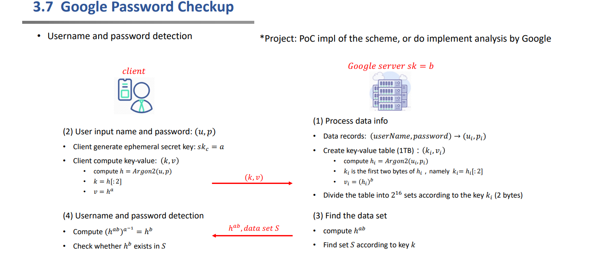
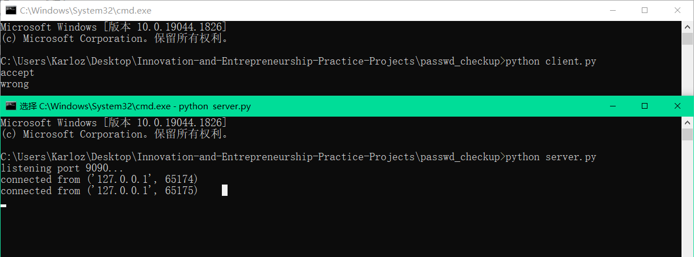

### Project: PoC impl of the scheme, or do implement analysis by Google

#### 代码说明

整体过程见下图。



本项目使用socket网络编程实现了网络交互式的用户口令检测方案。下面将分别介绍服务器与客户端的代码逻辑。

###### 服务器

首先，假定服务器本地已经获取了大量的用户名及其口令，并将其通过Argon2算法转换成了安全的存储方式。这样的过程事实上是在后台数据库完成的，不属于checkup交互的一部分。

这里只是实现了一个简单的示例，仅使用了少量的用户信息且与交互程序放在了同一个文件中。真实的场景下是直接读取的数据库中保存的hash后的数据而并不保存原始用户数据。

```python
Data_records = {'userA': '123', 'userB': '456', 'userC': '789'}

Set = [0] * 2 ** 16
for i in range(2 ** 16):
    Set[i] = []

for user in Data_records:
    h = Argon2(user, Data_records[user], 32)[-43:]
    k = bytes2int(h[:2])
    v = pow(bytes2int(h), b, p)
    Set[k].append(v)
```

------

建立了信息集合后，服务器端监听端口等待来自客户端的查询。

```python
print('listening port 9090...')
s.listen(5)

while True:
    sock, addr = s.accept()
    print('connected from', addr)
    checkup(sock, addr)
```

------

当接受了一个查询请求的连接后，执行checkup过程。

```python
def checkup(sock, addr):
    data = sock.recv(1024).decode()
    k, v = int(data[:64], 16), int(data[64:128], 16)

    hab = int2str(pow(v, b, p))
    S = ''
    for i in Set[k]:
        S += int2str(i)
    sock.send((hab + S).encode())
    sock.close()
```

从客户端接收其计算的k，v，计算$h^{ab}=(h^a)^b=v^b$。将$h^{ab}$以及键值为k的集合中保存的所有数据发回客户端，此时服务器的任务就已经完成，可以关闭连接。

###### 客户端

客户端要接受用户输入的用户名及口令，使用Argon2计算h，k，v的值，然后将k，v发送至服务器。

```python
s = socket.socket(socket.AF_INET, socket.SOCK_STREAM)
s.connect(('127.0.0.1', 9090))

userName, passWord = 'userA', '123'

h = Argon2(userName, passWord, 32)[-43:]
k = bytes2int(h[:2])
v = pow(bytes2int(h), a, p)

data = int2str(k) + int2str(v)
s.send(data.encode())
```

然后服务器会发回$h^{ab}$和S的信息。

```python
data = s.recv(1024).decode()
hab = int(data[:64], 16)
S = []
cnt = len(data) // 64 - 1
for i in range(cnt):
    S.append(int(data[(i + 1) * 64:(i + 2) * 64], 16))

hb = pow(hab, inv_mod(a, p-1), p)

if hb in S:
    print('accept')
else:
    print('wrong')

s.close()
```

客户端需要计算$h^b=(h^{ab})^{a^{-1}}$。如果输入的用户名和口令均正确，则得到的数字一定在发回的集合S中。由此判断是否通过验证。

###### argon2函数

本项目中使用了python的argon2-cffi库，并且进行了一些修改。

argon2提供的函数接口中，默认使用随机的字节流作为hash函数的salt，因此每次计算的hash值是不确定的。这导致无法获得确定性的结果，也就不能有效地将数据分割成多个集合。

观察hash库函数可以看到：又调用了新的过程hash_secret。而这个函数指出了各种参数，需要重点关注的是salt参数，很显然这里使用了随机的数据。

```python
    def hash(self, password: Union[str, bytes]) -> str:
        """
        Hash *password* and return an encoded hash.
        :param password: Password to hash.
        :type password: ``bytes`` or ``str``
        :raises argon2.exceptions.HashingError: If hashing fails.
        :rtype: str
        """
        return hash_secret(
            secret=_ensure_bytes(password, self.encoding),
            salt=os.urandom(self.salt_len),
            time_cost=self.time_cost,
            memory_cost=self.memory_cost,
            parallelism=self.parallelism,
            hash_len=self.hash_len,
            type=self.type,
        ).decode("ascii")
```

因此为了获得确定性的结果，并且考虑到需要将用户名也作为输入的一部分，这里选择将用户名经过sha256计算后所得的数据作为salt参与hash运算。这样就同时满足了上述两个要求。

```python
def Argon2(u, p, hlen):
    ph = PasswordHasher(hash_len=hlen)
    h = hash_secret(secret=ensurebytes(p, ph.encoding),
                    salt=hashlib.sha256(u.encode()).hexdigest().encode(),
                    time_cost=ph.time_cost,
                    memory_cost=ph.memory_cost,
                    parallelism=ph.parallelism,
                    hash_len=ph.hash_len,
                    type=ph.type)
    return h.decode()
```

#### 运行结果

分别选择一组正确的和错误的用户名口令对来测试效果。

见下图：可以证明系统功能的正确性。



#### 运行指导

首先需要按照argon2库。

在命令行中输入：pip install argon2-cffi即可。

然后执行代码，先执行server.py打开服务器端，然后运行客户端client.py即可。