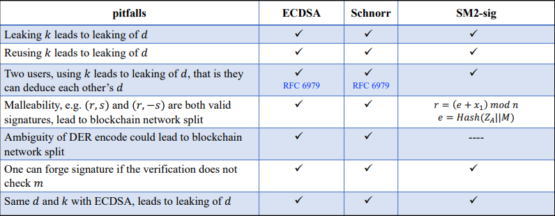
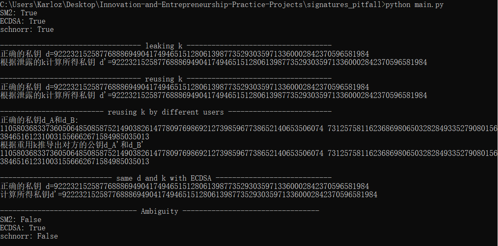

### **Project: verify the above pitfalls with proof-of-concept code**

该项目通过编写概念证明代码，表现了数字签名算法中存在的各种缺陷。

#### 代码说明

首先选择一种曲线，参数如下

```python
n = 0xFFFFFFFEFFFFFFFFFFFFFFFFFFFFFFFF7203DF6B21C6052B53BBF40939D54123
p = 0xFFFFFFFEFFFFFFFFFFFFFFFFFFFFFFFFFFFFFFFF00000000FFFFFFFFFFFFFFFF
g_X = 0x32c4ae2c1f1981195f9904466a39c9948fe30bbff2660be1715a4589334c74c7
g_Y = 0xbc3736a2f4f6779c59bdcee36b692153d0a9877cc62a474002df32e52139f0a0
a = 0xFFFFFFFEFFFFFFFFFFFFFFFFFFFFFFFFFFFFFFFF00000000FFFFFFFFFFFFFFFC
b = 0x28E9FA9E9D9F5E344D5A9E4BCF6509A7F39789F515AB8F92DDBCBD414D940E93
```

代码中分别实现了SM2,ECDSA,schnorr三种数字签名及其验证算法，并且进行了签名验证。

然后，对于签名算法中存在的各种安全隐患（见下图），编写代码进行了测试。



测试内容包括：

1. 泄露随机数k，推导出私钥。
2. 重用随机数k，推导出私钥。
3. 两个用户使用了同样的k，互相推导出对方的私钥。
4. SM2与ECDSA算法使用相同的私钥d和随机数k，可以根据两组签名推导私钥。
5. 对称性，即$(r,s)$和$(r,-s)$都是合法的签名。调用验签算法验证$(r,-s)$是否能通过检测。

具体的算法实现依照课程PPT的内容，这里不再赘述。

#### 运行结果

参考图中的文字说明。可以看到根据各种漏洞推导出的秘密信息完全正确，这验证了漏洞确实存在。



#### 运行指导

直接运行main.py即可

